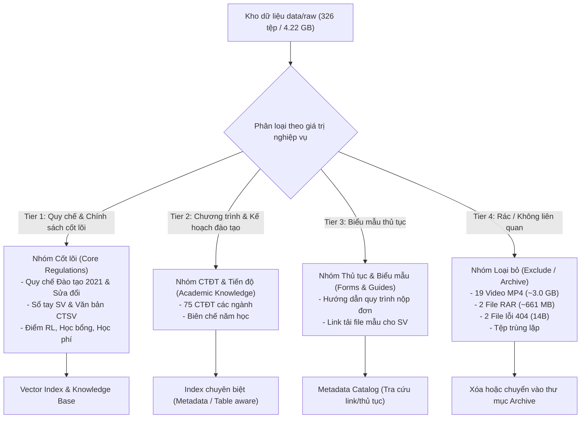

# BÁO CÁO ĐÁNH GIÁ HIỆN TRẠNG DỮ LIỆU THÔ (`data/raw`) VÀ ĐỀ XUẤT TỔ CHỨC LẠI CHO HỆ THỐNG SGU RAG

> **Ngày lập báo cáo:** 02/10/2026  
> **Dự án:** SGU RAG (LlamaIndex) — Hệ thống hỏi-đáp quy chế đào tạo & văn bản Trường Đại học Sài Gòn  
> **Mục tiêu:** Khảo sát, phân loại, đánh giá tính khả dụng của toàn bộ tệp trong `data/raw`, từ đó đề xuất cấu trúc lưu trữ và quy trình tiền xử lý chuẩn mực trước khi thực hiện bất kỳ thao tác thay đổi dữ liệu nào.

---

## 1. TỔNG QUAN HIỆN TRẠNG THƯ MỤC `data/raw`

Thư mục `data/raw` hiện có tổng cộng **326 tệp** (không tính `.gitkeep`), với tổng dung lượng xấp xỉ **4,22 GB**. Dữ liệu được thu thập từ hai nguồn chính:
1. **Các văn bản gốc ở thư mục gốc `data/raw/`**: Quy chế Đào tạo ĐHSG 2021 và Quyết định 3183/2025 về sửa đổi rút môn học.
2. **Dữ liệu crawl tự động từ website SGU (`data/raw/sgu_web/`)**: Được thu thập từ cổng Đào tạo (`daotao`), Công tác sinh viên (`ctsv`), và các Khoa (CNTT, QTKD, Luật, TCKT, KHXH&NT, Ngoại ngữ). Kèm theo tệp nhật ký `manifest.csv` (475 dòng log).

### 1.1. Thống kê theo định dạng tệp

| Định dạng | Số lượng | Tổng dung lượng | Khả năng ứng dụng cho Text RAG |
| :--- | :---: | :---: | :--- |
| **`.pdf`** | 202 | 545.84 MB | **Rất cao**: Nguồn tài liệu chính (quy chế, quyết định, CTĐT). |
| **`.docx`** | 57 | 1.29 MB | **Trung bình - Thấp**: Chủ yếu là biểu mẫu đơn từ, phụ lục đề cương. |
| **`.doc`** | 41 | 1.51 MB | **Trung bình - Thấp**: Các biểu mẫu hành chính định dạng cũ. |
| **`.mp4`** | 19 | 3,014.76 MB (~3.0 GB) | **Không dùng được**: Video giới thiệu, âm nhạc các khoa, clip truyền thông. |
| **`.rar`** | 2 | 661.15 MB | **Không dùng được**: File nén lưu trữ bài khóa luận của sinh viên khóa cũ. |
| **Không đuôi** | 3 | 2.27 MB | Gồm 2 tệp rác lỗi 404 (14 bytes) và 1 tệp PDF bị mất đuôi `.pdf` (2.37 MB). |
| **`.xlsx`** | 1 | 0.08 MB | Danh sách đề tài KLTN cũ (không có giá trị tri thức quy chế). |
| **`.csv`** | 1 | 0.16 MB | `manifest.csv`: Tệp metadata crawler cực kỳ giá trị để truy xuất nguồn gốc. |
| **Tổng cộng** | **326** | **~4,22 GB** | **87% dung lượng (~3.67 GB) là video và file nén không phục vụ RAG!** |

---

### 1.2. Thống kê phân bố theo thư mục

| Thư mục | Số tệp | Đặc điểm nội dung chính |
| :--- | :---: | :--- |
| `data/raw/` (gốc) | 2 | Quy chế đào tạo ĐHSG 2021, QĐ 3183/2025 sửa đổi rút môn học. |
| `sgu_web/daotao/chuong_trinh_dao_tao/` | 75 | 75 tệp PDF khung chương trình đào tạo các ngành (CNTT, KTPM, Luật, QTKD...). |
| `sgu_web/daotao/quy_che_quy_dinh/` | 23 | Các quyết định đào tạo, chuyển CTĐT, chuẩn tiếng Anh không chuyên, hoãn thi. |
| `sgu_web/daotao/quy_trinh_bieu_mau/` | 10 | Đơn phúc khảo, điều chỉnh ĐKMH, chuyển điểm, chuyển ngành. |
| `sgu_web/daotao/bien_che_nam_hoc/` | 4 | Kế hoạch tiến độ năm học qua các năm. |
| `sgu_web/ctsv/van_ban_ctsv/` | 19 | Thông tư Bộ GD&ĐT, Quy chế CTSV, Quy tắc ứng xử, Học bổng tuyển sinh. |
| `sgu_web/ctsv/thu_tuc/` | 24 | Hướng dẫn thủ tục sinh viên, đơn miễn giảm, đơn vay vốn, đơn xác nhận. |
| `sgu_web/ctsv/trang_chu/` | 16 | Thông báo chung, biên chế năm học, văn bản hướng dẫn. |
| `sgu_web/ctsv/che_do_chinh_sach/` | 9 | Nghị định 81/238 học phí, trợ cấp xã hội, học bổng khuyến khích. |
| `sgu_web/ctsv/diem_ren_luyen/` | 5 | Quy chế đánh giá điểm rèn luyện, phiếu tự đánh giá ĐRL. |
| `sgu_web/ctsv/so_tay_sinh_vien/` | 3 | Sổ tay sinh viên (nguồn hỏi đáp thực tế số 1 của sinh viên). |
| `sgu_web/khoa_cntt/` (5 thư mục con) | 63 | Quy chế KLTN, thực tập doanh nghiệp, biểu mẫu đồ án, điểm rèn luyện. |
| `sgu_web/khoa_ngoai_ngu/quy_che/` | 32 | Chứa **19 video mp4**, các mẫu phụ lục KLTN tiếng Anh. |
| `sgu_web/khoa_qtkd/` (2 thư mục con) | 20 | Quy chế 43, quy định thời gian tối đa, xét tốt nghiệp, các mẫu đơn QTKD. |
| `sgu_web/khoa_luat/bieu_mau_quy_dinh/` | 11 | Quy định KLTN, thu hoạch thực tế, đơn phúc khảo khoa Luật. |
| `sgu_web/khoa_tckt/` (3 thư mục con) | 4 | 2 file `.rar` KLTN (661MB), QĐ 3183 sửa đổi đào tạo, QĐ 3260 hoãn thi. |
| `sgu_web/khoa_khxhnt/bieu_mau/` | 5 | NĐ 116 sư phạm, quy định ĐRL, 2 tệp `fileManager` rỗng lỗi. |
| `sgu_web/manifest.csv` | 1 | Metadata nguồn crawl. |

---

### 1.3. Khảo sát chất lượng PDF (Text-based vs Scanned Image)

Đã kiểm tra tự động toàn bộ 202 tệp PDF bằng công cụ `pdftotext`:
- **PDF dạng số (Digital text - chọn copy được)**: **90 tệp** (44.6%). Các tệp này có thể trích xuất văn bản trực tiếp bằng `pypdf`/`pymupdf`, độ chính xác 100%, tốc độ nhanh gấp hàng chục lần OCR.
- **PDF dạng ảnh quét (Scanned PDF - cần OCR)**: **112 tệp** (55.4%). Gồm các quyết định đóng dấu đỏ, công văn scan, một số sổ tay sinh viên và quy chế cũ. Nhóm này bắt buộc phải đưa qua pipeline OCR (`pytesseract` + `pdf2image` hoặc mô hình OCR chuyên sâu).

---

## 2. CÁC VẤN ĐỀ TỒN TẠI NGHIÊM TRỌNG TRONG `data/raw`

### 2.1. Tệp rác và dung lượng thừa thãi (Chiếm > 87% dung lượng ổ đĩa)
1. **19 video `.mp4` (~3,01 GB) trong `khoa_ngoai_ngu/quy_che/`**: Đây là các video clip tuyên truyền tuyển sinh, clip giới thiệu trường ("Sinh viên nói về SGU", "SGU xin chào", nhạc giới thiệu các khoa). Hoàn toàn không liên quan đến quy chế văn bản và nằm sai thư mục.
2. **2 tệp nén `.rar` (661.15 MB) trong `khoa_tckt/khoa_luan/`**: `KLTN GIOI NH2024-2025.rar` (544 MB) và `KLTN NH2025-2026.rar` (117 MB). Đây là các bài nộp đồ án tốt nghiệp của sinh viên, không phục vụ mục đích tra cứu quy chế.
3. **2 tệp lỗi mạng 14 bytes**: `sgu_web/khoa_khxhnt/bieu_mau/fileManager` và `fileManager_1`. Khi kiểm tra nội dung, cả 2 tệp chỉ chứa dòng chữ `"File not found"` do server trả về lỗi 404 nhưng crawler vẫn lưu lại.

### 2.2. Trùng lặp dữ liệu (Data Duplication)
Qua kiểm tra mã băm MD5, phát hiện **12 nhóm tệp trùng lặp 100% nội dung**, gây lãng phí bộ nhớ và nguy cơ nhiễu kết quả truy vấn RAG (Retrieval bị trả về nhiều chunk giống hệt nhau):
- **Quy chế Đào tạo 2021**: Trùng lặp 3 bản tại:
  - `data/raw/4. QuyCheDaoTaoDHSG 2021.pdf`
  - `sgu_web/daotao/quy_che_quy_dinh/4. QuyCheDaoTaoDHSG 2021.pdf`
  - `sgu_web/ctsv/van_ban_ctsv/25.pdf`
- **Quy định Điểm rèn luyện**: Trùng lặp đến **5 bản** giống hệt nhau tại:
  - `sgu_web/khoa_qtkd/quy_dinh/07.-Quy-dinh-dinh-danh-gia-diem-RL.pdf`
  - `sgu_web/khoa_khxhnt/bieu_mau/QUY-DINH-VE-DANH-GIA-KET-QUA-REN-LUYEN-SV-DHSG.pdf`
  - `sgu_web/ctsv/diem_ren_luyen/1.pdf`
  - `sgu_web/ctsv/van_ban_ctsv/26.pdf`
  - `sgu_web/khoa_cntt/diem_ren_luyen/DRL_Quy-dinh-danh-gia-ket-qua-ren-luyen.pdf`
- **QĐ 3183/2025 Sửa đổi rút môn học**: Trùng 3 bản tại thư mục gốc, `khoa_tckt/sua_doi_quy_che/` và `daotao/quy_che_quy_dinh/`.
- **QĐ Điều chỉnh Khóa luận tốt nghiệp 2025**: Trùng 3 bản tại `khoa_ngoai_ngu`, `khoa_luat`, `khoa_cntt`.
- **QĐ Hoãn thi (QĐ 3260)**: Trùng 2 bản tại `khoa_tckt/hoan_thi/3260-QD-Hoan-thi-.pdf` và `daotao/quy_che_quy_dinh/20251120143954840_HoanThi.pdf`.

### 2.3. Lỗi mã hóa tên tệp (Mojibake) và tệp mất phần mở rộng
- Nhiều tệp có tên tiếng Việt bị lỗi font do crawler không decode URL đúng chuẩn:
  - Ví dụ: `Danh saÌ?ch HoÌ£Ì?i Ä?oÌ?Ì?ng khoÌ?a luaÌ£Ì?n 2025-2026_GuiSV.pdf`
  - Ví dụ: `2366-TB-Ä HSG_ tô chức dạy há» c các há» c phần tiếng Anh...`
- **Tệp bị mất đuôi `.pdf`**: `sgu_web/khoa_cntt/khoa_luan/2022-11-15-2590-QÄ -Ä HSG-QÄ  vá»  việc ban hà nh...` (Dung lượng 2.37 MB, kiểm tra magic byte là `%PDF-1.4`). Đây là văn bản quy định khóa luận tốt nghiệp quan trọng nhưng đang không mở được bằng phần mềm đọc tài liệu do thiếu đuôi `.pdf`.

### 2.4. Biểu mẫu đơn từ (.doc / .docx)
- Có 98 tệp Word (`.doc`, `.docx`). Đa số là khung biểu mẫu để điền (mẫu bìa đồ án, đơn xin nghỉ học, đơn xin hoãn thi, mẫu phiếu đánh giá rèn luyện).
- **Vấn đề với RAG**: Nếu đưa trực tiếp toàn bộ các tệp Word này vào vector index, các câu từ khuôn mẫu ("Cộng hòa xã hội chủ nghĩa Việt Nam", "Họ và tên: ...", "MSSV: ...") sẽ làm loãng vector space, khiến việc tìm kiếm quy chế thực tế bị nhiễu.

---

## 3. PHÂN LOẠI & ĐÁNH GIÁ MỨC ĐỘ KHẢ DỤNG CHO DỰ ÁN SGU RAG

Dựa trên mục tiêu xây dựng Chatbot RAG giải đáp quy chế, thủ tục và học tập cho sinh viên SGU, toàn bộ tài nguyên được chia thành 4 nhóm rõ rệt:



### Chi tiết từng nhóm:

#### Nhóm 1: TÀI LIỆU CỐT LÕI (TIER 1 - Ưu tiên hàng đầu cho RAG Index)
Đây là các tài liệu sinh viên hỏi nhiều nhất: điều kiện cảnh báo học vụ, cách tính điểm GPA, điều kiện tốt nghiệp, rút học phần, xin hoãn thi, cách tính điểm rèn luyện, điều kiện nhận học bổng:
1. `QuyCheDaoTaoDHSG 2021.pdf` (Văn bản mẹ điều chỉnh đào tạo tín chỉ).
2. `QD 3183.2025` (Sửa đổi quy chế đào tạo liên quan rút môn học - quy định mới nhất).
3. `3260-QD-Hoan-thi-.pdf` / `20251120143954840_HoanThi.pdf` (Quy định về việc hoãn thi).
4. `so_tay_sinh_vien/` (Các ấn bản Sổ tay sinh viên của trường).
5. `che_do_chinh_sach/` (Nghị định 81/238 về học phí, miễn giảm, hỗ trợ chi phí, học bổng khuyến khích học tập).
6. `diem_ren_luyen/` (Quy định đánh giá kết quả rèn luyện sinh viên).
7. `van_ban_ctsv/` (Quy tắc ứng xử, khen thưởng, kỷ luật, nội trú/ngoại trú).
8. `quy_che_quy_dinh/` (Chuẩn ngoại ngữ không chuyên, quy định chuyển ngành, chuyển CTĐT).
9. `khoa_luan/` & `thuc_tap/` (Quy chế KLTN số 2590 và các hướng dẫn thực tập).

#### Nhóm 2: CHƯƠNG TRÌNH ĐÀO TẠO & KẾ HOẠCH NĂM HỌC (TIER 2)
1. **75 tệp CTĐT (`daotao/chuong_trinh_dao_tao/`)**:
   - Chứa khung chương trình từng ngành (CNTT, KTPM, Sư phạm Toán, Ngoại ngữ, Luật, QTKD...).
   - *Cách sử dụng:* Rất giá trị cho các câu hỏi: "Ngành CNTT cần tích lũy bao nhiêu tín chỉ?", "Môn Kiến trúc máy tính học ở kỳ mấy?". Tuy nhiên, dữ liệu này chủ yếu là bảng danh mục môn học, cần áp dụng cơ chế chunking bảo toàn cấu trúc bảng hoặc metadata filter theo `ma_nganh` / `ten_nganh`.
2. **Biên chế năm học (`daotao/bien_che_nam_hoc/`)**:
   - Dùng để trả lời câu hỏi về thời gian bắt đầu học kỳ, lịch nghỉ Tết, lịch thi.

#### Nhóm 3: BIỂU MẪU & THỦ TỤC HÀNH CHÍNH (TIER 3)
- Gồm ~98 tệp DOC/DOCX và các hướng dẫn thủ tục.
- *Khuyến nghị sử dụng:* **Không nên nạp nội dung đơn trống vào Vector Store**. Thay vào đó, trích xuất văn bản hướng dẫn thủ tục (ví dụ: "Muốn hoãn thi cần chuẩn bị hồ sơ gì, nộp cho ai, trước bao nhiêu ngày?"). Khi sinh viên hỏi xin mẫu đơn, hệ thống sẽ trả về tên biểu mẫu hoặc đường link tải tương ứng.

#### Nhóm 4: LOẠI BỎ / CÁCH LY KHỎI PIPELINE (TIER 4)
- **19 video `.mp4`**: Xóa hoặc chuyển sang thư mục lưu trữ riêng ngoài repo/pipeline. Giải phóng ngay **3,01 GB**.
- **2 tệp `.rar`**: Xóa hoặc chuyển sang kho lưu trữ riêng. Giải phóng ngay **661 MB**.
- **2 tệp `fileManager` (14B)**: Xóa vì là lỗi 404.
- **Tệp `.xlsx` danh sách KLTN**: Không dùng cho RAG quy chế.
- **Các bản sao chép trùng lặp**: Giữ lại 1 bản duy nhất có tên chuẩn, xóa bỏ các bản duplicate.

---

## 4. ĐỀ XUẤT TỔ CHỨC LẠI THƯ MỤC DỮ LIỆU

Nhằm tối ưu cho pipeline RAG của LlamaIndex và dễ dàng phân quyền, gắn metadata khi tạo vector index, đề xuất quy hoạch lại cấu trúc dữ liệu như sau:

```
data/
├── raw/                                  # Kho tài liệu gốc (Đã dọn dẹp, chuẩn hóa tên file)
│   ├── 01_quy_che_dao_tao/               # Quy chế 2021, QĐ sửa đổi 3183, hoãn thi, chuyển ngành...
│   ├── 02_cong_tac_sinh_vien/            # Sổ tay SV, điểm rèn luyện, khen thưởng kỷ luật, học bổng...
│   ├── 03_chuong_trinh_dao_tao/          # 75 CTĐT chuẩn hóa tên: [MãNgành]_[TênNgành].pdf
│   ├── 04_khoa_luan_thuc_tap/            # Quy định 2590, hướng dẫn thực tập, tiêu chuẩn KLTN
│   ├── 05_bieu_mau_thu_tuc/              # Biểu mẫu tham khảo (.docx/.doc) & quy trình SV
│   │   ├── daotao/
│   │   ├── ctsv/
│   │   └── theo_khoa/
│   ├── metadata_manifest.csv             # Bản nâng cấp của manifest.csv (URL gốc, tên chuẩn, hash)
│   └── _archive/                         # (Tùy chọn) Chứa video, rar nếu người dùng vẫn muốn giữ bản gốc
│
├── ocr/                                  # Kết quả OCR dạng Markdown (cho 112 file PDF dạng scan)
│   ├── 01_quy_che_dao_tao/
│   ├── 02_cong_tac_sinh_vien/
│   └── ...
│
└── processed/                            # Dữ liệu chuẩn bị cho LlamaIndex Ingestion
    ├── documents/                        # Tài liệu Markdown đã làm sạch header/footer, chuẩn cấu trúc
    └── metadata.jsonl                    # Metadata chi tiết từng văn bản (số hiệu, ngày ban hành, phạm vi áp dụng)
```

---

## 5. BẢNG TỔNG KẾT SO SÁNH TRƯỚC VÀ SAU KHI TỐI ƯU

| Chỉ số | Hiện trạng ban đầu | Sau khi đề xuất tái tổ chức | Lợi ích mang lại |
| :--- | :--- | :--- | :--- |
| **Dung lượng thư mục `raw`** | **~4.22 GB** | **~550 MB** | **Tiết kiệm ~3.67 GB (~87%)**, sao lưu và xử lý cực nhanh |
| **Số lượng tệp rác / không liên quan** | 24 tệp (19 mp4, 2 rar, 2 404, 1 xlsx) | 0 tệp trong pipeline | Tránh lỗi crash loader, không nhầm lẫn domain |
| **Tệp trùng lặp** | 12 nhóm (trùng lặp từ 2 - 5 lần) | Loại bỏ trùng lặp, giữ 1 bản chuẩn | Tiết kiệm chi phí Embedding, không bị nhiễu Ranker |
| **Tên tệp** | Lỗi font (Mojibake), mất đuôi, đặt tên theo ID (`25.pdf`) | Chuẩn hóa UTF-8, có số hiệu văn bản rõ ràng | Dễ debug, LLM trích dẫn nguồn chính xác |
| **Phân luồng xử lý** | Đang gộp chung | Tách riêng: Digital PDF (parse ngay) vs Scanned PDF (OCR) | Tăng tốc độ xây dựng dữ liệu gấp 5-10 lần |

---

## 6. KẾ HOẠCH HÀNH ĐỘNG DỰ KIẾN (CHỜ Ý KIẾN NGƯỜI DÙNG)

Để đảm bảo tuân thủ yêu cầu *"không thực hiện bất kỳ thao tác nào ngoài việc đọc trước khi người dùng xem báo cáo"*, các bước tiếp theo chỉ được triển khai khi bạn đồng ý:

1. **Bước 1: Phê duyệt phương án xử lý tệp lớn (`.mp4`, `.rar`)**:
   - *Lựa chọn A (Khuyến nghị):* Xóa bỏ các tệp video và file nén đồ án để giải phóng 3.67 GB.
   - *Lựa chọn B:* Di chuyển các tệp này sang thư mục lưu trữ ngoài (`data/archive_media/` hoặc vị trí riêng) và cấu hình `.gitignore` để không bị đẩy vào git/index.
2. **Bước 2: Chạy kịch bản dọn dẹp tự động (Automated Cleanup Script)**:
   - Xóa các tệp lỗi 14 bytes (`fileManager`).
   - Sửa tệp thiếu đuôi `2022-11-15-2590...` thành `.pdf`.
   - Chuẩn hóa tên tệp Unicode bị lỗi mojibake.
3. **Bước 3: Tái cấu trúc thư mục và lọc tệp trùng**:
   - Sắp xếp tài liệu vào các nhóm chức năng (`01_quy_che_dao_tao`, `02_cong_tac_sinh_vien`, `03_chuong_trinh_dao_tao`...).
   - Đồng bộ hóa lại `metadata_manifest.csv`.
4. **Bước 4: Triển khai trích xuất văn bản**:
   - Trích xuất trực tiếp 90 tệp PDF digital sang Markdown.
   - Chạy batch OCR cho 112 tệp PDF scan còn lại.
