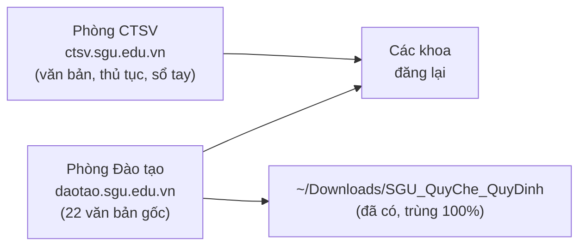
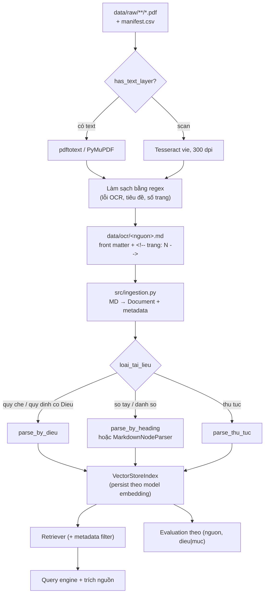

# Báo cáo mở rộng corpus và quy trình OCR → Markdown → LlamaIndex

> Ngày lập: 01/10/2026 · Repo: `sgu-rag-llamaindex` · Bổ sung cho [`bao_cao_phan_tich_yeu_cau.md`](bao_cao_phan_tich_yeu_cau.md)

---

## Mục lục

1. [Tóm tắt](#1-tóm-tắt)
2. [Bối cảnh: vì sao cần mở rộng corpus](#2-bối-cảnh-vì-sao-cần-mở-rộng-corpus)
3. [Khảo sát nguồn tài liệu](#3-khảo-sát-nguồn-tài-liệu)
4. [Kết quả tải dữ liệu](#4-kết-quả-tải-dữ-liệu)
5. [Phân tích các phương án mở rộng corpus](#5-phân-tích-các-phương-án-mở-rộng-corpus)
6. [Chunking cho tài liệu không có "Điều"](#6-chunking-cho-tài-liệu-không-có-điều)
7. [OCR → Markdown → LlamaIndex: có phù hợp yêu cầu không](#7-ocr--markdown--llamaindex-có-phù-hợp-yêu-cầu-không)
8. [Pipeline đề xuất](#8-pipeline-đề-xuất)
9. [Thay đổi cần làm ở đánh giá](#9-thay-đổi-cần-làm-ở-đánh-giá)
10. [Lộ trình thực hiện](#10-lộ-trình-thực-hiện)
11. [Vấn đề tồn đọng và việc cần quyết định](#11-vấn-đề-tồn-đọng-và-việc-cần-quyết-định)

---

## 1. Tóm tắt

- **Corpus hiện tại quá nhỏ:** chỉ có Quy chế đào tạo 2021 (17 trang, 21 node). Với 21 node, Recall@10 = 100% gần như không có ý nghĩa, vì top-10 là lấy về một nửa corpus.
- **Đã khảo sát:** trang CTSV, Phòng Đào tạo và 14 khoa (13 truy cập được). Thu được **472 link file**, đã tải **367 file** (gồm 3 Sổ tay lấy từ Wayback Machine) vào `data/raw/sgu_web/`, kèm `manifest.csv`.
- **Các khoa hầu như không có quy định riêng.** Họ đăng lại văn bản cấp trường. Nguồn gốc là **Phòng Đào tạo** (22 văn bản, đều là bản scan) và **CTSV** (văn bản, 14 quy trình thủ tục, Sổ tay sinh viên).
- **Phương án đề xuất:** mở rộng theo 2 giai đoạn.
  1. Thêm các văn bản học vụ hiện hành có cấu trúc "Điều"; dùng lại `parse_by_dieu`.
  2. Thêm Sổ tay sinh viên và thủ tục CTSV, viết **parser riêng theo tiêu đề**.
- **OCR → Markdown → LlamaIndex phù hợp với yêu cầu bản 1409**, với điều kiện: bước chuyển đổi là script chạy lại được, giữ metadata (nguồn, số hiệu, năm, trang) và phần nạp dữ liệu vẫn do LlamaIndex thực hiện.
- **Cần quyết định:** xóa khoảng 3,8 GB file không liên quan đã bị tải theo (video, file nén); có lấy khoảng 40 file Drive bị hạn chế quyền không; xử lý `.gitignore` trước khi commit.

---

## 2. Bối cảnh: vì sao cần mở rộng corpus

| Vấn đề | Số liệu hiện tại | Hệ quả |
|---|---|---|
| Corpus chỉ có 1 văn bản | 17 trang, 34.276 ký tự | Ít loại câu hỏi; không thử được đa nguồn, lọc metadata |
| Số node quá ít | 21 node (mỗi Điều 1 node) | Recall@10 = 100% không phân biệt được cấu hình tốt hay xấu |
| Thiếu văn bản sửa đổi | QĐ 3183/2025 có trong `data/raw` nhưng chưa nạp | `test_questions_02.json` hỏi về "quy định sửa đổi" nhưng corpus không có |
| Chỉ một dạng cấu trúc | Toàn bộ theo "Điều X" | Chưa chứng minh được parser tùy biến cho tài liệu khác cấu trúc (mục 1B bản 1409) |

Mở rộng corpus phục vụ trực tiếp các yêu cầu của bản 1409:
- **1B:** "Nhiều nguồn dữ liệu hoặc nhiều collection", "Custom splitter/node parser", "Metadata filtering".
- **Tầng 3:** số liệu so sánh có ý nghĩa hơn khi corpus đủ lớn.

---

## 3. Khảo sát nguồn tài liệu

### 3.1. Phạm vi khảo sát

- `ctsv.sgu.edu.vn`: trang chủ và 5 trang văn bản (văn bản CTSV, chế độ chính sách, sổ tay sinh viên, điểm rèn luyện, thủ tục hành chính).
- `daotao.sgu.edu.vn`: quy chế, quy định (5 nhóm), biểu mẫu, biên chế năm học, chương trình đào tạo, sổ tay đăng ký môn học.
- 14 trang khoa liệt kê ở trang chủ CTSV. **Khoa Kỹ thuật và Công nghệ (`fet.sgu.edu.vn`) từ chối kết nối** cả https lẫn http.

### 3.2. Nguồn gốc của văn bản



Cùng một văn bản xuất hiện ở nhiều nơi. Ví dụ QĐ 736/2014 (thời gian tối đa được học) có ở CTSV, Khoa CNTT và Khoa Quản trị kinh doanh. Corpus phải **khử trùng lặp** theo nội dung (sha256), không theo tên file.

### 3.3. Phòng Đào tạo: 5 nhóm quy chế, quy định

| Nhóm | Văn bản |
|---|---|
| Quy chế đào tạo đại học | QC 2017 (QĐ 3022/2017); **QC 2021 (QĐ 258/2022)**; chuyển chương trình đào tạo (2375/2022); học cùng lúc hai chương trình (QĐ 810/2024); **QĐ 3183/2025 sửa đổi QC (rút học phần)** |
| Quy đổi tiếng Anh | QĐ 2101/2024; CV 2626 (từ khóa 2022); TB 2567 (PTE Academic); TB 2451 (khóa 2021 trở về trước); TB 2366/2021 |
| Thi kết thúc học phần | Chiến lược dạy học, kiểm tra, đánh giá (QĐ 154/2018); QyĐ 3089 tổ chức thi; **QĐ 898/2025 tổ chức thi học kỳ**; **hoãn thi và thi lại 2025** (đăng 2 lần cùng một file); khiếu nại kết quả học tập (CV 3248); quy trình phúc khảo |
| Xét tốt nghiệp | QyĐ 2695/2019 và TB 2696/2019 (liên thông VLVH); TB 536 chuẩn đầu ra ngoại ngữ (2020) |
| Học vụ khác | Cấp bản sao văn bằng; cấp bảng điểm; chuyển chương trình, ngành đào tạo (CV 2375) |

Toàn bộ 22 PDF ở đây là **bản scan**, bắt buộc OCR.

### 3.4. CTSV: tài liệu mới

| Nhóm | Nội dung chính | Dạng |
|---|---|---|
| Văn bản CTSV (19) | Quy chế công tác SV; TT 08/2021; VBHN 17/2014; QC liên thông, VLVH; **quy định khối lượng đào tạo**; **quy định khóa luận tốt nghiệp**; **QĐ 736/2014**; QC 2021; **điểm rèn luyện**; **quy chế học bổng tuyển sinh 1357/2026 + sửa đổi 2946/2026**; các văn bản ngoài đào tạo (an ninh, nội trú, ma túy, văn hóa ứng xử) | 13 có text, 6 scan |
| Thủ tục hành chính (24) | 14 quy trình: xét điểm rèn luyện, học bổng KKHT, chế độ chính sách, bảo lưu, học lại, thôi học, rút hồ sơ, xác nhận, chuyển trường…; 10 mẫu đơn | PDF có text + `.doc` |
| Điểm rèn luyện (5) | Quy định; thông báo bổ sung phiếu; mẫu phiếu, biên bản, đơn | PDF có text + `.doc` |
| Chế độ chính sách (9) | NĐ 238/2025 học phí; QĐ 66/2013; VBHN 05/2021 học bổng; NĐ 57/2017; mẫu đơn | 2 có text, 3 scan |
| **Sổ tay sinh viên** | 2020–2021 P1, P2; 2021–2022 P1, P2; 2022–2023 P1, P2 | **Link trên web bị chết** (xem 4.3) |
| Cẩm nang hỗ trợ SV 2022 | Bản thiết kế, 41 MB | Phần lớn là ảnh |

### 3.5. Các khoa: chỉ ghi phần không trùng

| Khoa | Tài liệu riêng |
|---|---|
| Công nghệ thông tin | Số tín chỉ tối thiểu kỹ sư CNTT; quy đổi Tiếng Anh 1-2-3; cố vấn học tập; KLTN 2022 + QĐ điều chỉnh 2025; kế hoạch thực tập, khóa luận; QC thạc sĩ, tiến sĩ, liên thông |
| Giáo dục | Danh mục 14 văn bản mới nhất (QĐ 3260/2025 hoãn thi, 2886/2025 sửa KLTN, 1195/2024 học phần đại cương, 753/2024 dạy chuyên môn bằng tiếng Anh, 2876/2023 thư điện tử…). Phần lớn nhúng Drive, **đa số bị 404**. Sổ tay Khoa 2024–2025 chỉ có bản in |
| Luật | Hướng dẫn phúc khảo; quy định KLTN + sửa đổi; thực tế chuyên môn |
| Ngoại ngữ | Cố vấn học tập; thực tập sư phạm, tốt nghiệp. Trang "quy chế" còn chứa **20 video quảng bá** |
| Quản trị kinh doanh | 7 văn bản cũ (2014–2018): QC 43, xét công nhận tốt nghiệp 2014, QĐ 736, TT57, đầu ra 2017, điểm rèn luyện |
| Tài chính – Kế toán | Đăng lại QĐ hoãn thi, QĐ 3183/2025; 2 file nén tổng hợp khóa luận |
| GD Mầm non, GD Tiểu học, GD Chính trị, KHXH&NT, SP KHTN, Toán ƯD, Văn hóa – Du lịch | Chủ yếu chương trình đào tạo, chuẩn đầu ra và biểu mẫu theo ngành |

---

## 4. Kết quả tải dữ liệu

### 4.1. Tổng quan

- Thư mục: `data/raw/sgu_web/<nguon>/<nhom>/`
- Manifest: `data/raw/sgu_web/manifest.csv` với các cột `nguon, nhom, tieu_de, url, trang, file, bytes, sha256, text_chars, status`. Cột `text_chars` là số ký tự text trong 3 trang đầu; dưới 200 thì coi là bản scan.

| Trạng thái | Số link |
|---|---|
| Tải thành công | 364 |
| Lấy từ Wayback Machine | 3 |
| Server trả HTML thay vì file (link chết, Drive bị hạn chế quyền) | 71 |
| Lỗi 404 | 27 |
| Thư mục Drive (không tải) | 7 |
| **Tổng** | **472** |

Phân bố theo loại file đã tải: 244 PDF, 98 `.doc`/`.docx`, 1 `.xlsx`, **19 `.mp4`, 2 `.rar`**.

### 4.2. Theo nhóm

| Nguồn | Nhóm | Số file | Dung lượng | PDF có text / scan |
|---|---|---|---|---|
| Phòng Đào tạo | Quy chế, quy định | 23 | 32,6 MB | 0 / 22 |
| | Sổ tay đăng ký môn học HK1 2026–2027 | 44 | 10,9 MB | 44 / 0 |
| | Chương trình đào tạo | 75 | 404 MB | 29 / 46 |
| | Biên chế năm học | 4 | 1,4 MB | 0 / 4 |
| | Biểu mẫu | 10 | 0,6 MB | 1 / 0 |
| CTSV | Văn bản | 19 | 15,9 MB | 13 / 6 |
| | Thủ tục | 24 | 2,1 MB | 14 / 0 |
| | Điểm rèn luyện | 5 | 0,7 MB | 2 / 0 |
| | Chế độ chính sách | 9 | 18,4 MB | 2 / 3 |
| | Trang chủ (thông báo, cẩm nang) | 16 | 51,7 MB | 3 / 13 |
| | **Sổ tay sinh viên (Wayback)** | 3 | 10,5 MB | **3 / 0** |
| Khoa CNTT | Quy chế, KLTN, thực tập, biểu mẫu, ĐRL | 63 | 10,1 MB | 7 / 9 |
| Khoa Luật | Biểu mẫu, quy định | 11 | 9,4 MB | 4 / 5 |
| Khoa QTKD | Quy định, biểu mẫu | 20 | 2,2 MB | 6 / 1 |
| Khoa KHXH&NT | Biểu mẫu | 5 | 5,6 MB | 2 / 1 |
| Khoa TCKT | Hoãn thi, sửa đổi QC, **KLTN (.rar)** | 4 | **694 MB** | 0 / 2 |
| Khoa Ngoại ngữ | **Video quảng bá (.mp4)** + văn bản | 32 | **3,1 GB** | 1 / 2 |

### 4.3. Sổ tay sinh viên

Các link Sổ tay trên `ctsv.sgu.edu.vn/chucnang/stsv.php` (`/webin/menutrai/stsv/...`) **đều trả về trang chủ**, tức link đã chết. Tôi lấy được bản lưu từ Wayback Machine:

| Bản | Trang | Có text | File |
|---|---|---|---|
| 2020–2021 Phần 1: Thông tin chung | 88 | Có | `ctsv/so_tay_sinh_vien/1.pdf` |
| 2021–2022 Phần 1: Thông tin chung | 85 | Có | `ctsv/so_tay_sinh_vien/nh20212022_p1.pdf` |
| 2021–2022 Phần 2: Kế hoạch đào tạo theo ngành | 143 | Có | `ctsv/so_tay_sinh_vien/nh20212022_p2.pdf` |
| 2020–2021 Phần 2; 2022–2023 Phần 1, 2 | — | — | **Không còn bản lưu** |

Ba bản Sổ tay đều **có lớp text**, không cần OCR. Đây là ứng viên tốt để thử parser theo tiêu đề.

---

## 5. Phân tích các phương án mở rộng corpus

| # | Phương án | Mô tả |
|---|---|---|
| P1 | Sổ tay chung index với Quy chế | Một `VectorStoreIndex`, phân biệt bằng metadata `nguon` |
| P2 | Sổ tay index riêng + router | Hai index; `RouterQueryEngine` chọn index theo câu hỏi |
| P3 | Mở rộng bằng các quy định có sẵn | Nạp văn bản học vụ cùng dạng "Điều" |
| **P4** | **Kết hợp theo giai đoạn** | GĐ1 làm P3; GĐ2 thêm Sổ tay (chỉ các chương không trùng quy chế) + thủ tục, có parser riêng |

| Tiêu chí | P1 | P2 | P3 | P4 |
|---|---|---|---|---|
| Khớp bản 1409 | 1B nhiều nguồn + metadata filter | 1B nhiều collection + Tầng 3 router | 1B nhiều nguồn; mở đường cho kỹ thuật xử lý hiệu lực văn bản | Đủ cả hai |
| Dùng lại code | Thấp | Thấp | **Cao** | Cao rồi trung bình |
| Rủi ro trùng lặp, mâu thuẫn | Cao: sổ tay in lại trích đoạn quy chế (có thể bản cũ) | Trung bình | Cao nhưng có giá trị: QC 2017 → 2021 → QĐ 2025 | Thấp nếu lọc phần trùng |
| Đánh giá | Phải đổi nhãn | Thêm chỉ số chọn đúng index | Phải đổi nhãn `(nguon, dieu)` | Như P3 + nhãn theo mục |
| Độ khó | ★★☆ | ★★★ | ★★☆ | ★★★ |

**Đề xuất: P4.**

### 5.1. Danh sách chọn vào corpus

| Tầng | Tài liệu | Parser |
|---|---|---|
| **1 – Lõi học vụ hiện hành** | QC 2021 (đã có); QĐ 3183/2025 (đã có); hoãn thi và thi lại 2025; QĐ 898/2025 thi học kỳ; khiếu nại kết quả học tập; quy trình phúc khảo; QĐ 810/2024 hai chương trình; chuyển chương trình 2375; quy định khóa luận tốt nghiệp; khối lượng đào tạo; quy đổi tiếng Anh 2101/2024; điểm rèn luyện | `parse_by_dieu` (sẵn có) |
| **2 – Khác cấu trúc** | Sổ tay SV 2021–2022 Phần 1; 14 quy trình thủ tục CTSV; sổ tay đăng ký môn học HK1 2026–2027 (phần dùng chung); biên chế năm học 2026–2027 | Parser theo tiêu đề; parser theo bước; bảng |
| **3 – Đối chứng phiên bản** (chỉ khi làm kỹ thuật xử lý hiệu lực) | QC 2017; VBHN 17/2014; QĐ 736/2014; Sổ tay 2020–2021 | Như trên + metadata hiệu lực |
| **Không đưa vào corpus** | Biểu mẫu `.doc`/`.docx`; chương trình đào tạo theo ngành; Sổ tay Phần 2; cẩm nang; thông báo sự kiện; văn bản ngoài đào tạo; video, file nén | Ít giá trị hỏi đáp hoặc ngoài phạm vi |

Tầng 1 và 2 đưa corpus từ 21 node lên khoảng vài trăm node.

---

## 6. Chunking cho tài liệu không có "Điều"

Sổ tay, thủ tục và một số quy định (ví dụ QĐ 736/2014) **không viết theo "Điều X"**. Với `parse_by_dieu`, mỗi trang sẽ thành một node `khong_co_dieu`, không trích dẫn được và không chấm được đúng/sai.

### 6.1. Kiến trúc: giữ parser cũ, thêm bước phân loại

```python
def parse_documents(documents):
    nodes = []
    for doc in documents:
        loai = doc.metadata.get("loai_tai_lieu")
        if loai in ("so_tay", "quy_dinh_danh_so"):
            nodes += parse_by_heading([doc])
        elif loai == "thu_tuc":
            nodes += parse_thu_tuc([doc])
        else:
            nodes += parse_by_dieu([doc])
    return nodes
```

Mọi parser đều trả về `list[TextNode]` với cùng bộ metadata cơ bản, nên `index_builder.py` và `validate_nodes` dùng chung được.

### 6.2. Các phương án tách

| Phương án | Cách làm | Ưu | Nhược | Vai trò |
|---|---|---|---|---|
| A. Tách theo tiêu đề (regex) | Nhận dạng `I.` → `1.` → `1.1.` → `a)`; mỗi mục lá 1 node; mục dài cắt tiếp bằng `SentenceSplitter` | Giữ đường dẫn mục để trích dẫn | Nhạy với lỗi OCR ở tiêu đề | Chính, khi tiêu đề sạch |
| **B. Markdown + `MarkdownNodeParser`** | Chuyển sang MD có `#`/`##`/bảng, dùng parser có sẵn của LlamaIndex | Dùng đúng thành phần LlamaIndex; giữ được bảng | Tốn công chuẩn hóa MD một lần | **Khuyến nghị** |
| C. `SemanticSplitterNodeParser` | Cắt khi embedding câu liền kề đổi nghĩa | Không cần cấu trúc | Mất nhãn mục | Đối chứng |
| D. `SentenceSplitter` cố định | Cắt theo token | Đơn giản | Cắt ngang mục, bảng | Baseline |

Thí nghiệm so sánh A/B/C/D trên Sổ tay có thể đưa thẳng vào Chương 5 của báo cáo đồ án.

### 6.3. Xử lý riêng theo loại nội dung

| Nội dung | Cách tách | Lý do |
|---|---|---|
| Bảng (học bổng, thang rèn luyện, danh bạ) | Giữ nguyên nếu ngắn; bảng dài thì mỗi nhóm dòng 1 node, **lặp lại dòng tiêu đề** | Mất tiêu đề thì con số vô nghĩa |
| Hỏi đáp | Mỗi cặp hỏi–đáp 1 node | Khớp tự nhiên với câu hỏi |
| Thủ tục nhiều bước | Giữ trọn các bước trong 1 node | Cắt giữa chừng sẽ ra câu trả lời thiếu bước |
| Liên hệ | Mỗi đơn vị 1 node | Câu hỏi nhắm đúng một đơn vị |
| Đoạn in lại quy chế trong sổ tay | Bỏ, hoặc gắn `trung_quy_che=True` | Tránh hai node gần giống nhau |

### 6.4. Ví dụ thực tế: QĐ 736/2014 (thời gian tối đa)

Văn bản 2 trang, có lớp text, đánh số theo ma trận *hình thức × trình độ*:

```
1. Hình thức đào tạo chính quy
   1.1. Trình độ đại học, cao đẳng   → +06 học kỳ
   1.2. Trình độ trung cấp           → +2 năm học
   1.3. Hệ liên thông                → +04 học kỳ
2. Hình thức đào tạo vừa làm vừa học
   2.1. Trình độ đại học, cao đẳng   → +5 năm học
   2.2. Trình độ trung cấp           → +3 năm học
   2.3. Hệ liên thông                → +4 năm học
```

| Quyết định | Đề xuất | Lý do |
|---|---|---|
| Đơn vị node | Mỗi mục cấp 2 một node (6 node), cộng phần mở đầu và phần hiệu lực | Câu hỏi nhắm đúng một ô |
| Ngữ cảnh cha | **Ghép đường dẫn tiêu đề vào đầu text**: *"QĐ 736/2014 > 2. Vừa làm vừa học > 2.3. Hệ liên thông"* | "1.3" và "2.3" có tiêu đề giống hệt nhau |
| Đoạn "Căn cứ…" | Đưa vào metadata `can_cu`, loại khỏi embedding (`excluded_embed_metadata_keys`) | Đoạn này dài và lặp lại, làm các node giống nhau |
| Hiệu lực | `so_hieu`, `nam=2014`, `ap_dung_tu="2013-2014"` | Có thể đã bị QC 2021 thay thế; phải xử lý mâu thuẫn |

Cảnh báo: `test_questions_01.json` đã có câu *"Thời gian tối đa để hoàn thành khóa học là bao lâu?"* (đáp án Điều 2 QC 2021). Thêm QĐ 736/2014 mà không có metadata hiệu lực thì retriever có thể trả về quy định cũ.

---

## 7. OCR → Markdown → LlamaIndex: có phù hợp yêu cầu không

**Kết luận: phù hợp**, và đây cũng là cách repo đang làm một phần (`data/ocr/*.md` → `index_builder.py`).

Cần phân biệt: file Markdown **không nạp vào model**. Nó được nạp vào **LlamaIndex** (Document → Node → Index). LLM chỉ nhận vài node đã truy hồi khi trả lời.

### 7.1. Đối chiếu với bản 1409

| Yêu cầu | Cách OCR → MD đáp ứng |
|---|---|
| 1A: "Nạp dữ liệu vào LlamaIndex: Document/metadata và pipeline ingestion cơ bản" | OCR → MD là **tiền xử lý**. Phần MD → `Document` có metadata → Node → Index vẫn do LlamaIndex làm, và đây là phần được chấm |
| "Chưa đạt nếu chỉ dán nguyên tài liệu dài vào prompt" | Không phạm: MD vẫn được chia node, embedding, truy hồi |
| 1B: "Custom splitter/node parser" | MD có tiêu đề giúp dùng `MarkdownNodeParser` hoặc parser theo tiêu đề |
| 1A: "giữ khả năng truy vết về nguồn" | Đạt **nếu** MD giữ metadata nguồn và số trang |
| Tầng 2: khả năng chạy lại | Đạt **nếu** OCR → MD là script trong repo |

### 7.2. Điều kiện bắt buộc

| Điều kiện | Lý do | Hiện trạng |
|---|---|---|
| Bước OCR → MD là **script chạy lại được bằng một lệnh** | Buổi thực hành tại chỗ có thể yêu cầu thêm tài liệu mới | `ingestion.py` có OCR nhưng **không xuất MD**; chưa rõ `data/ocr/*.md` tạo bằng gì |
| **Chọn cách đọc theo loại PDF** (có text thì đọc thẳng, scan thì OCR) | Kho tài liệu có cả hai loại; OCR file có text chỉ thêm lỗi | `has_text_layer()` đã có nhưng chưa dùng |
| **Giữ metadata** khi chuyển MD | Truy vết nguồn là lõi 1A | `index_builder.py` đang **xóa** dòng `## Trang N`, nên mất số trang |
| Sửa tay MD phải ghi lại (tốt nhất bằng regex trong script) | Báo cáo phải tái lập được dữ liệu | — |
| **Không để LLM viết lại nội dung** khi chuyển MD | LLM có thể bịa hoặc đổi con số quy chế | — |
| Dùng AI để OCR hoặc làm sạch thì phải khai báo | Mục AI Disclosure và mô tả dữ liệu | — |

### 7.3. Lợi ích thêm

- OCR chậm (khoảng 30 giây/17 trang) chỉ chạy **một lần**. Đổi chunk hay embedding chỉ cần dựng lại index; thuận tiện cho thí nghiệm chunking.
- Đo được **chất lượng OCR (CER)** trên MD so với vài trang gõ tay (kỹ thuật D1).
- Chương 4.1 báo cáo tách rõ hai tầng: *tiền xử lý* (OCR → MD) và *ingestion LlamaIndex* (MD → Document). Phần sau mới là lõi công nghệ.

---

## 8. Pipeline đề xuất



### 8.1. Định dạng file Markdown

```markdown
---
nguon: QD3260_2025
so_hieu: 3260/QyĐ-ĐHSG
nam: 2025
loai_tai_lieu: quy_dinh
hieu_luc: dang_ap_dung
file_goc: daotao/quy_che_quy_dinh/20251120143954840_HoanThi.pdf
sha256: <sha256 của file gốc>
phuong_phap: ocr_tesseract_vie
---
<!-- trang: 1 -->
# Quy định về việc hoãn thi ...

## Điều 1. Phạm vi điều chỉnh ...
```

### 8.2. Metadata thống nhất cho mọi node

| Trường | Ví dụ | Dùng cho |
|---|---|---|
| `nguon` | `QC2021`, `QD3183_2025`, `SoTay_2021` | Trích dẫn, lọc, nhãn đánh giá |
| `loai_tai_lieu` | `quy_che`, `quy_dinh`, `thu_tuc`, `so_tay` | Chọn parser, lọc |
| `so_hieu`, `nam` | `3183/QĐ-ĐHSG`, `2025` | Trích dẫn |
| `hieu_luc` | `dang_ap_dung`, `het_hieu_luc`, `chua_xac_dinh` | Xử lý mâu thuẫn phiên bản |
| `dieu` hoặc `muc`, `duong_dan_muc` | `7` / `2.3` / `2. Vừa làm vừa học > 2.3. Hệ liên thông` | Trích dẫn, đánh giá |
| `trang` | `3` | Truy vết nguồn |
| `file_goc`, `sha256` | đường dẫn trong `data/raw` | Tái lập, khử trùng lặp |

---

## 9. Thay đổi cần làm ở đánh giá

1. **Đổi nhãn câu hỏi.** `dieu_dung: "7"` mơ hồ khi nhiều văn bản cùng có Điều 7.
   - Văn bản quy định: `{"nguon": "QD3183_2025", "dieu": "7"}`.
   - Sổ tay, thủ tục: `{"nguon": "SoTay_2021", "muc": "3.2"}`. Có thể chấm đúng khi trúng mục cha (so khớp tiền tố).
2. **Gắn lại nguồn cho `test_questions_02.json`**, vì bộ này hỏi theo "quy định sửa đổi".
3. **Báo cáo Recall theo từng nguồn**, để xem thêm tài liệu có làm giảm chất lượng trả lời câu về Quy chế 2021 không.
4. **Thêm bộ câu hỏi mới** cho Tầng 1 và 2 (hoãn thi, phúc khảo, bảo lưu, thôi học, học bổng KKHT…) và câu hỏi **ngoài corpus**.
5. **Thêm câu hỏi mâu thuẫn phiên bản** (ví dụ thời gian tối đa: QĐ 736/2014 với QC 2021) nếu làm kỹ thuật xử lý hiệu lực.

---

## 10. Lộ trình thực hiện

| Bước | Việc | Kết quả |
|---|---|---|
| 0 | Sửa lỗi lệch chiều vector của index (lưu index theo model embedding) | Pipeline chạy ổn định ở cấu hình mặc định |
| 1 | Dọn `data/raw/sgu_web`: xóa video, file nén; chọn danh sách Tầng 1, 2 vào `data/corpus_list.csv` | Danh sách corpus có chủ đích |
| 2 | Viết `scripts/pdf_to_md.py` (chọn text hay OCR, front matter, giữ trang) | `data/ocr/*.md` tái lập được |
| 3 | Sửa `ingestion.py`: đọc MD → `Document` + metadata | Ingestion đúng lõi 1A |
| 4 | Nạp Tầng 1 (dùng `parse_by_dieu`), đổi nhãn đánh giá, chạy lại Recall/MRR | Số liệu trên corpus vài trăm node |
| 5 | Viết `parse_by_heading` / `MarkdownNodeParser` cho Sổ tay, QĐ 736; `parse_thu_tuc` cho thủ tục | Nạp Tầng 2 |
| 6 | Thí nghiệm chunking A/B/C/D trên Sổ tay | Bảng so sánh cho Chương 5 |
| 7 | (Tùy chọn) Tầng 3 + metadata hiệu lực | Kỹ thuật xử lý hiệu lực văn bản |

---

## 11. Vấn đề tồn đọng và việc cần quyết định

| # | Vấn đề | Đề xuất | Cần quyết định |
|---|---|---|---|
| 1 | **Khoảng 3,8 GB file không phải tài liệu đào tạo** đã bị tải theo: 19 video `.mp4` (khoảng 3,1 GB, trang Khoa Ngoại ngữ) và 2 file `.rar` khóa luận (khoảng 692 MB, Khoa TCKT) | Xóa | **Có** |
| 2 | **`.gitignore` không loại `data/raw`**: dòng `# data/raw/*.pdf` đang bị comment; 4,2 GB có thể bị `git add` nhầm | Thêm `data/raw/sgu_web/` vào `.gitignore` (nhóm tự làm) | **Có** |
| 3 | **Khoảng 40 file Google Drive bị hạn chế quyền**, chủ yếu chương trình đào tạo chu kỳ 2024–2028 | Không cần cho corpus hiện tại; nếu cần thì mở qua Chrome đã đăng nhập tài khoản SGU | **Có** |
| 4 | **27 link 404**, phần lớn là Drive nhúng ở trang Khoa Giáo dục (file đã xóa hoặc private) | Bỏ qua; văn bản tương ứng đa số đã có từ Phòng Đào tạo | Không |
| 5 | **Sổ tay 2022–2023 không còn ở đâu** (link chết, không có bản lưu Wayback) | Dùng bản 2021–2022; hỏi CTSV nếu cần bản mới | Không |
| 6 | **Khoa Kỹ thuật và Công nghệ** từ chối kết nối | Thử lại sau | Không |
| 7 | **Một số tên file bị lỗi mã hóa** (UTF-8 bị đọc thành Latin-1 từ header của Drive) | Đổi tên theo `tieu_de` trong manifest khi dọn dữ liệu | Không |
| 8 | **Toàn bộ quy chế của Phòng Đào tạo là bản scan**, chất lượng OCR chưa đo | Đo CER trên 2–3 trang mẫu trước khi nạp hàng loạt | Không |
| 9 | Hiệu lực của các văn bản cũ (QC 2017, VBHN 17/2014, QĐ 736/2014) **chưa được xác minh** | Đối chiếu điều khoản thay thế trong QC 2021 | Không |
