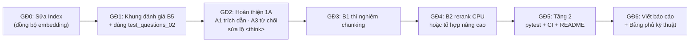

# Báo cáo phân tích yêu cầu & kế hoạch đồ án RAG LlamaIndex

> Ngày lập: 01/10/2026 · Repo: `sgu-rag-llamaindex` · Đề tài: hỏi đáp Quy chế đào tạo trình độ đại học Trường Đại học Sài Gòn bằng LlamaIndex

---

## Mục lục

1. [Tóm tắt điều hành](#1-tóm-tắt-điều-hành)
2. [Nguồn tài liệu và cách xác minh](#2-nguồn-tài-liệu-và-cách-xác-minh)
3. [Chênh lệch giữa bản 1409 CHI TIẾT và Danh mục gốc](#3-chênh-lệch-giữa-bản-1409-chi-tiết-và-danh-mục-gốc)
4. [Hiện trạng code thật](#4-hiện-trạng-code-thật)
5. [Đối chiếu Tầng 1A với code và bước tiếp theo duy nhất](#5-đối-chiếu-tầng-1a-với-code-và-bước-tiếp-theo-duy-nhất)
6. [Tầng 2: chuẩn kỹ nghệ phần mềm](#6-tầng-2-chuẩn-kỹ-nghệ-phần-mềm)
7. [Kỹ thuật nâng cao](#7-kỹ-thuật-nâng-cao)
8. [Lộ trình thực hiện](#8-lộ-trình-thực-hiện)
9. [Cấu trúc báo cáo đồ án đề xuất](#9-cấu-trúc-báo-cáo-đồ-án-đề-xuất)
10. [Checklist trước khi nộp và rủi ro](#10-checklist-trước-khi-nộp-và-rủi-ro)
11. [Sườn báo cáo đồ án chi tiết](#11-sườn-báo-cáo-đồ-án-chi-tiết)

---

## 1. Tóm tắt điều hành

Pipeline RAG của nhóm đã chạy đủ 6 khâu lõi với profile `local`, đạt **Recall@3 = 87,1%** trên 31 câu hỏi. Tuy vậy, với cấu hình mặc định trong `.env` (`RAG_PROFILE='server'`), mọi khâu từ Retriever trở đi đều lỗi.

- **Yêu cầu mới:** bản `1409_Tong_hop_yeu_cau_cong_nghe_CHI_TIET` (ghi là "bản phác thảo") siết lõi LlamaIndex từ 3 lên **6 mục Tầng 1A**. Chunking, truy vết nguồn và đánh giá thực nghiệm nay là bắt buộc. Tài liệu thêm danh sách *minh chứng tối thiểu* và mục *"chưa được xem là đạt nếu chỉ…"*. Deadline và rubric không đổi.
- **Code thật:** Ingestion, Node parser và Index hoạt động. Index đã lưu dùng vector 768 chiều, nhưng profile `server` nạp model 1024 chiều. Kết quả là Retriever và Evaluation lỗi `shapes (1024,) and (768,) not aligned`, còn Query engine ở `server` hết bộ nhớ GPU (3,7 GB).
- **Bước tiếp theo duy nhất:** sửa khâu **Index**, tức đồng bộ model embedding giữa index đã lưu và profile đang bật.
- **Kỹ thuật nâng cao khuyến nghị:** khung đánh giá (MRR, bảng retrieval/answer/source), thí nghiệm chunking, rerank chạy CPU. Nếu muốn đào sâu: truy hồi phân cấp Chương → Điều → Khoản kết hợp giải tham chiếu chéo, khai thác đúng đặc thù văn bản pháp quy.
- **Cần hỏi giảng viên:** bản 1409 là bản phác thảo. Nên xác nhận lõi LlamaIndex là 3 mục (Phần F bản gốc) hay 6 mục (bản 1409) trước khi chốt Chương 4.

---

## 2. Nguồn tài liệu và cách xác minh

Cả 3 file đều đọc được nội dung thật. File 1 và File 3 trùng bản đã dùng từ đầu dự án; File 2 là tài liệu mới.

| File | Số trang | Cách đọc | Kết luận |
|---|---|---|---|
| [03_cau_truc_bao_cao.pdf](https://drive.google.com/file/d/1za5TaUgiqmnymeN3_rxdu2RH2JCIhfF3/view) | 14 | Mở bản Drive qua Chrome; toàn văn lấy từ bản trên máy `/mnt/data/3_Resources/Documents/` | Trùng bản gốc |
| [1409_Tong_hop_yeu_cau_cong_nghe_CHI_TIET_bản phác thảo.pdf](https://drive.google.com/file/d/1Y1NfLBOdZeLsbo_NziQhfaUYthJKInJ7/view) | 18 | Đọc toàn văn qua Chrome đã đăng nhập | **Tài liệu mới**, có chênh lệch thật (mục 3) |
| [01_Danh_muc_cong_nghe_Goi_y.pdf](https://drive.google.com/file/d/1XReXrLKkkCWsfrU8tsHMVgsobeLhKUoN/view) | 24 | Mở bản Drive qua Chrome; toàn văn lấy từ bản trên máy | Trùng bản gốc |

Ghi chú xác minh:

- File 1 và File 3 chỉ được so theo tiêu đề, số trang và đoạn mở đầu, chưa so khớp từng byte.
- Cả 3 file ở chế độ chia sẻ "Bị hạn chế" và đã tắt quyền tải xuống. Tải trực tiếp và Google Drive connector đều thất bại vì connector đăng nhập bằng tài khoản khác. Chỉ trình duyệt đã đăng nhập mới xem được.

---

## 3. Chênh lệch giữa bản 1409 CHI TIẾT và Danh mục gốc

Bảng dưới chỉ ghi phần **khác nhau**, không chép lại phần trùng.

| Mục | Bản gốc (01_Danh_muc) | Bản 1409 CHI TIẾT | Ảnh hưởng tới code |
|---|---|---|---|
| Cách chia tầng | Tầng 1 / 2 / 3; LlamaIndex có "Bắt buộc lõi" và "Chọn thêm" ở Phần F | Tầng **1A** (lõi) / **1B** (tự chọn theo ứng dụng) / 2 / 3; bỏ cách đánh số Phần A/B1/F, tổ chức lại theo track | Trung bình, chủ yếu đổi cách khai báo trong báo cáo |
| Lõi LlamaIndex | 3 mục: nạp dữ liệu; lập chỉ mục; retriever và query engine | **6 mục** (xem bảng ngay dưới) | **Cao** |
| Phần tự chọn | Chiến lược cắt đoạn; gắn nguồn; rerank; lọc metadata; nhiều nguồn | 1B có 8 mục: metadata filter, hiển thị citation, **persistent index**, **custom node parser**, nhiều nguồn/collection, hội thoại/query transformation, rerank, cập nhật index tăng dần | Thấp; code đã có persistent index và custom parser |
| Minh chứng tối thiểu (mới) | Không có | (a) sơ đồ pipeline thật; (b) hiện **top-k node** của một số câu, không chỉ đáp án cuối; (c) **bộ câu hỏi nhỏ và bảng kết quả retrieval/answer/source** | **Cao**: chưa có bảng answer/source |
| "Chưa đạt nếu chỉ…" (mới) | Không có | Dán nguyên tài liệu vào prompt; chỉ gọi `VectorStoreIndex.from_documents()` + `query()` mà không xem node; đánh giá bằng vài câu hỏi tự chọn lúc demo; chọn miền quá khó như "kết luận rủi ro pháp lý" | Thấp; đề tài là tra cứu quy chế, không phải tư vấn pháp lý |
| Câu hỏi tự kiểm (mới) | Một câu: "Đoạn văn bản nào đã được đưa vào ngữ cảnh…" | Ba câu: câu trả lời tạo từ node nào; tăng chunk size/top-k thì retrieval đổi ra sao; **câu hỏi không có trong tài liệu thì hệ thống làm gì** | Trung bình; chưa có test câu ngoài corpus |
| Đề thực hành mẫu (mới) | Không có | Đổi chunk size/top-k và so sánh; thêm metadata filter/citation; tạo câu hỏi ngoài corpus và chỉnh hệ thống để từ chối/giới hạn | Trung bình |
| Tầng 2 | Phần D, mô tả chung | Liệt kê cụ thể: Git (nhánh, PR, review chéo), README chạy lại được, `.env.example`, **test**, **CI (GitHub Actions)**, bảo mật cơ bản, xử lý lỗi/log, tài liệu kỹ thuật, khai báo dùng AI | Trung bình; repo chưa có test và CI |
| Tầng 3 Track AI | Phần C4: 6 nhóm (truy hồi nâng cao, tác tử, đa phương thức, tối ưu chi phí, đánh giá tự động, an toàn) | Ưu tiên **"đo được, so sánh được"**; truy hồi nâng cao phải **chứng minh cải thiện trên bộ câu hỏi**; thêm observability, tối ưu inference | Chỉ ảnh hưởng nếu nhóm khai Tầng 3 |
| Checklist trước khi nộp (mới, mục 5) | Không có | 8 mục, trong đó: đánh dấu 1A kèm file/module; Bảng phủ kỹ thuật phải khớp code; mọi thành viên sửa được code mà không dùng AI | Ảnh hưởng báo cáo |
| Rubric / mốc thời gian | 12 tuần; cổng thực hành tại chỗ | **Không thay đổi**; cổng Đạt/Không đạt giữ nguyên | Không |

### 3.1. Sáu mục Tầng 1A của LlamaIndex theo bản 1409

1. Nạp dữ liệu vào LlamaIndex: Document/metadata và pipeline ingestion cơ bản.
2. Chia tài liệu thành Node/chunk; giải thích chunk size/overlap ở mức ứng dụng.
3. Embedding và lập chỉ mục; hiểu vector index lưu và tra cứu biểu diễn gì.
4. Retriever: query → truy hồi các node liên quan; biết top-k và similarity ở mức sử dụng.
5. Query/response synthesis: dùng context đã truy hồi để tạo câu trả lời và **giữ khả năng truy vết về nguồn**.
6. Có **đánh giá thực nghiệm tối thiểu** ở khâu retrieval hoặc answer grounding; không chỉ "thấy trả lời đúng".

### 3.2. Cảnh báo

> **Phần F bản gốc ghi lõi LlamaIndex là 3 mục, bản 1409 ghi 6 mục.** Chunking và đánh giá vốn đã có trong quy trình B1 (hồ sơ RAG) của bản gốc, nên đây là siết chặt hơn chứ không hẳn mâu thuẫn. Tuy vậy, bản 1409 còn ghi là "bản phác thảo". Báo cáo này không chọn bên nào là chuẩn; nhóm nên hỏi giảng viên.

---

## 4. Hiện trạng code thật

### 4.1. Cấu trúc repo (phần liên quan)

```
src/
  config.py          # RAGConfig + 2 profile: local, server
  ingestion.py       # OCR PDF scan → Document (Tesseract, tiếng Việt)
  node_parser.py     # parse_by_dieu: tách theo "Điều X", sub-chunk nếu > 1024 token
  index_builder.py   # build/load VectorStoreIndex, persist vào storage/vector_index
  retriever.py       # as_retriever(top_k) + rerank tuỳ chọn
  query_engine.py    # RetrieverQueryEngine + Ollama + prompt QA tiếng Việt
  pipeline.py        # CLI hỏi đáp tương tác
eval/
  evaluate.py        # Recall@1/3/5/10
  test_questions_01.json   # 31 câu
  test_questions_02.json   # 10 câu (chưa dùng)
  results/           # rỗng
data/raw/            # QuyCheDaoTaoDHSG 2021.pdf, QD 3183.2025 (sửa đổi)
data/ocr/            # 4. QuyCheDaoTaoDHSG 2021.md (OCR sẵn)
storage/vector_index # index đã persist
```

### 4.2. Cấu hình hai profile

| Thuộc tính | `local` | `server` |
|---|---|---|
| Embedding | `bkai-foundation-models/vietnamese-bi-encoder` (768 chiều) | `AITeamVN/Vietnamese_Embedding` (1024 chiều) |
| LLM (Ollama) | `qwen3:4b` | `qwen3:8b` |
| Reranker | Tắt | `AITeamVN/Vietnamese_Reranker` |
| `similarity_top_k` | 10 | 10 |
| `response_mode` | `compact`, streaming | `compact`, streaming |

`.env` hiện đặt `RAG_PROFILE='server'`. Máy chạy có GPU 4 GB (PyTorch báo dùng được 3,73 GB).

### 4.3. Kết quả chạy thử (01/10/2026)

`python3` của hệ thống (miniconda) không có `llama_index`, nên mọi lệnh chạy bằng `venv/bin/python` (Python 3.14).

| Lệnh | Profile `server` (mặc định) | Profile `local` |
|---|---|---|
| `scripts/test_node_parser.py` | **CHƯA LÀM ĐƯỢC**: file không tồn tại | như trên |
| `src/ingestion.py` | OCR 17 trang, 34.276 ký tự, metadata `nguon/trang/file_goc`, mất khoảng 32 giây | không phụ thuộc profile |
| `src/node_parser.py` | 24 node (gồm cả Điều 1–3 của Quyết định ban hành) | không phụ thuộc profile |
| `src/index_builder.py` | Tải index đã lưu: 21 node, khớp số node parser | tương tự |
| `src/retriever.py` | **Lỗi** `ValueError: shapes (1024,) and (768,) not aligned` | Chạy được, trả top-10 node |
| `src/query_engine.py` | **Lỗi** `torch.OutOfMemoryError: CUDA out of memory` | Trả lời "3 học kỳ"; lộ phần suy luận `</think>` tiếng Anh; "Nguồn" liệt kê cả 10 Điều đã truy hồi |
| `eval/evaluate.py` | **Lỗi** (cùng lỗi lệch chiều vector) | 31 câu: Recall@1 64,5% · @3 87,1% · @5 90,3% · @10 100% |
| `src/pipeline.py` | Không chạy (CLI tương tác, phụ thuộc query engine) | Chưa chạy |

### 4.4. Các vấn đề phát hiện khi đọc code

1. **Index không ghi lại model embedding đã dùng.** `build_or_load_index` chỉ kiểm tra có `docstore.json` hay không, nên khi đổi profile thì tải nhầm index của model khác. Đây là nguyên nhân lỗi lệch chiều vector.
2. **Mất metadata trang.** `load_documents()` gộp cả file OCR thành 1 Document để không cắt ngang Điều, nên node trong index chỉ còn `dieu`, không còn `trang`.
3. **Hai đường nạp dữ liệu khác nhau.** `node_parser.py` chạy độc lập cho 24 node, còn `index_builder.py` bỏ trang 1 nên còn 21 node. Số Điều 1–3 của Quyết định ban hành trùng với số Điều 1–3 của Quy chế.
4. **Danh sách nguồn không chính xác.** `format_sources` in tất cả node đã truy hồi chứ không phải node thực sự dùng để trả lời.
5. **Lộ phần suy luận của qwen3.** Đặt `thinking=False` vẫn để lộ khối `<think>` khi đi qua bước refine (prompt refine mặc định bằng tiếng Anh).
6. **Corpus rất nhỏ.** 21 node khiến Recall@10 gần như vô nghĩa, vì top-10 trên 21 node là lấy về một nửa corpus.
7. **Lỗi OCR còn trong văn bản**, ví dụ "chị tiết", "nắm học", "I." thay cho "1.", "TL." thay cho "1.".
8. **Chưa nạp QĐ 3183/2025.** File có trong `data/raw` nhưng `CORPUS_SOURCES` đang comment dòng này; đường dẫn trong `config.py` cũng không khớp tên file thật.
9. **Đánh giá chưa đầy đủ.** `test_questions_02.json` chưa dùng; `eval/results/` rỗng; chưa có bảng answer/source, chưa có câu hỏi ngoài corpus.

---

## 5. Đối chiếu Tầng 1A với code và bước tiếp theo duy nhất

| Yêu cầu | Bản gốc | Bản 1409 đổi gì | Code hiện tại | Đánh giá |
|---|---|---|---|---|
| 1. Ingestion | Lõi | Thêm Document/metadata | `ingestion.py` OCR, metadata 3 trường | **Đạt** |
| 2. Node/chunk | B1 bắt buộc, F để tự chọn | Lõi, phải giải thích chunk size/overlap | `parse_by_dieu`, SentenceSplitter 1024/50 | **Một phần**: chưa có thực nghiệm chunk size/overlap |
| 3. Embedding + index | Lõi | Giữ nguyên | Persist index, 21 node | **Lỗi với cấu hình mặc định** |
| 4. Retriever | Lõi | Thêm top-k/similarity | `as_retriever(top_k=10)` | Chạy ở `local`; lỗi ở `server` vì phụ thuộc mục 3 |
| 5. Response synthesis | Lõi (query engine) | Phải giữ truy vết nguồn | Prompt QA tiếng Việt, `format_sources` | **Một phần**: nguồn chưa chính xác, lộ phần suy luận |
| 6. Đánh giá | B1: thực nghiệm ở khâu retrieval | Retrieval hoặc grounding, kèm bảng retrieval/answer/source | Recall@k trên 31 câu | **Một phần**: thiếu bảng answer/source, chưa lưu kết quả |
| Pipeline | Không có | Sơ đồ pipeline nằm trong minh chứng tối thiểu | `pipeline.py` CLI | Chưa chạy được ở cấu hình mặc định |

### Bước tiếp theo duy nhất: Index

Thứ tự phụ thuộc: Ingestion → Node → **Index** → Retriever → Response Synthesis → Evaluation → Pipeline.

Index là khâu sớm nhất đang hỏng với cấu hình mặc định, và nó làm hỏng luôn mọi khâu phía sau. Cách sửa gợi ý:

- Lưu index riêng theo model embedding, ví dụ `storage/vector_index/<tên_model>`. Hoặc ghi tên model vào thư mục persist và kiểm tra lại khi tải.
- Chốt một profile làm chuẩn trong `.env`. Trên GPU 3,7 GB, profile `server` (embedding 1024 chiều + reranker + qwen3:8b) không chạy đồng thời được.

Quyết định dùng profile nào là của nhóm.

---

## 6. Tầng 2: chuẩn kỹ nghệ phần mềm

| Yêu cầu (bản 1409) | Hiện trạng | Việc cần làm |
|---|---|---|
| Git: nhánh, PR, review chéo, commit có ý nghĩa | Có nhánh `ad`, lịch sử có merge PR (#4, #5, #6) | Duy trì; mỗi tính năng một PR |
| README chạy lại được: phiên bản runtime, lệnh cài, lệnh chạy | Có `README.md` (đang sửa dở) | Ghi rõ Python 3.14, venv, Ollama, model cần pull, cách chọn profile |
| Docker/docker compose khi hợp lý | Chưa có | Tùy chọn; có thể đóng gói Ollama + app |
| Cấu hình và bí mật qua biến môi trường, có `.env.example` | Có `.env`, `.env.example`, `RAG_PROFILE` | Kiểm tra `.env` đã nằm trong `.gitignore` |
| Kiểm thử phù hợp (với AI: test dữ liệu/đánh giá) | **Chưa có** test tự động | pytest cho `parse_by_dieu`, `extract_dieu_number`; test hồi quy Recall@k không giảm dưới ngưỡng |
| CI (GitHub Actions) build/lint/test | **Chưa có** | Workflow chạy lint + unit test (không cần GPU) |
| Bảo mật cơ bản | Chưa có kiểm thử | Liên quan nhất: prompt injection qua câu hỏi người dùng |
| Xử lý lỗi và log | `ingestion.py` có logging và ngoại lệ riêng | Bắt lỗi Ollama timeout/không kết nối; log thời gian từng bước |
| Tài liệu kỹ thuật: model, config, nguồn dữ liệu | Có `config.py`, `docs/task-0.md` | Bảng model/config và mô tả cách chuẩn bị dữ liệu OCR |
| Khai báo dùng AI | Chưa có | Ghi nhật ký dùng AI để làm mục AI Disclosure (Chương 13) |

---

## 7. Kỹ thuật nâng cao

### 7.1. Nguyên tắc chọn

- Bản 1409 nhấn mạnh: không chấm cao vì dùng nhiều thư viện hay nhiều kỹ thuật. Một kỹ thuật chỉ có giá trị khi được dùng đúng, gắn với bài toán, giải thích được cơ chế và có minh chứng đo đạc.
- Tầng 3 Track AI ưu tiên **"đo được, so sánh được"**. Một kỹ thuật làm sâu, có đánh giá tốt hơn nhiều kỹ thuật ghép vào mà không kiểm chứng.
- Kỹ thuật nào khai trong báo cáo thì **mọi thành viên** phải giải thích và sửa được tại buổi thực hành tại chỗ, không dùng AI.

### 7.2. Ràng buộc thực tế

| Ràng buộc | Hệ quả |
|---|---|
| GPU 3,7 GB | Không chạy đồng thời embedding 1024 chiều + reranker + LLM 8B; reranker nên chạy CPU |
| 21 node (mỗi Điều 1 node) | Recall@10 không có ý nghĩa; cần chunk mịn hơn hoặc dùng MRR, Recall@1/3 |
| Recall@1 = 64,5% | Khoảng trống cải thiện rõ nhất, phù hợp rerank |
| LLM qwen3:4b | Viết lại truy vấn, sub-question, LLM judge đều có thể kém; phải đo |
| Văn bản OCR còn lỗi | Ảnh hưởng BM25 và chất lượng chunk |
| Có văn bản sửa đổi (QĐ 3183/2025) | Cơ hội cho kỹ thuật xử lý hiệu lực văn bản |

### 7.3. Nhóm A: Tầng 1B, dễ làm, khớp code hiện có

| # | Kỹ thuật | Vì sao hợp với đề tài | Cách làm trong code | Minh chứng cần có |
|---|---|---|---|---|
| A1 | **Trích dẫn nguồn chính xác** | Hiện "Nguồn" in cả 10 Điều; bản 1409 yêu cầu truy vết nguồn ngay ở lõi 1A | `format_sources` chỉ in node thực sự vào ngữ cảnh; thêm số khoản và số trang. Cần giữ metadata `trang` | 5 câu hỏi kèm đoạn nguồn được trích |
| A2 | **Nhiều nguồn + lọc metadata** | QĐ 3183/2025 sửa đổi Quy chế 2021 (phần rút môn học) | Nạp QĐ 2025 qua `ingestion.py`; metadata `nguon`, `nam`, `hieu_luc`; `MetadataFilters` | Câu hỏi về rút môn học: so sánh có và không có QĐ 2025 |
| A3 | **Từ chối câu hỏi ngoài corpus** | Trùng đề thực hành mẫu của bản 1409 | `SimilarityPostprocessor(similarity_cutoff=…)` kết hợp prompt; chọn ngưỡng từ phân bố điểm thật (top-1 hiện khoảng 0,33) | 10 câu ngoài corpus: tỉ lệ từ chối đúng và từ chối nhầm |
| A4 | Custom node parser, persistent index | **Đã có** (`parse_by_dieu`, `storage/`) | Chỉ cần trình bày cơ chế | Số node; thời gian tải lại so với dựng lại |
| A5 | Lịch sử hội thoại (tùy chọn) | Chỉ khi demo có hỏi tiếp | `CondenseQuestionChatEngine` | 3 kịch bản hỏi tiếp |

### 7.4. Nhóm B: Tầng 3 cơ bản, có đo đạc

| # | Kỹ thuật | Mức phù hợp | Chi tiết | Đo bằng gì |
|---|---|---|---|---|
| **B1** | **Thí nghiệm chunking** | Nên làm nhất | So sánh: theo Điều (hiện tại), theo Khoản, `SentenceSplitter` 256/512, Điều kèm overlap; chấm đúng ở cấp Điều cho công bằng. Củng cố luôn lõi 1A mục 2 | Recall@1/3/5, MRR, số node, độ dài trung bình |
| **B2** | **Rerank** | Nên làm | Nhắm thẳng vào Recall@1 = 64,5%. Chạy reranker bằng CPU (`device="cpu"`), thử `AITeamVN/Vietnamese_Reranker` hoặc `bge-reranker-v2-m3` | Recall@1 và MRR trước/sau; độ trễ tăng thêm (ms) |
| B3 | Hybrid search (BM25 + vector) | Khá | `QueryFusionRetriever` + `BM25Retriever`; cần tách từ tiếng Việt (`pyvi`/`underthesea`); nên làm sau khi sạch OCR | Như B2, tách riêng câu có từ khóa chính xác |
| B4 | Viết lại truy vấn / HyDE | Thấp | Gọi qwen3:4b thêm một lần mỗi câu; chỉ làm nếu B2/B3 chưa đủ | Recall và độ trễ |
| **B5** | **Khung đánh giá nâng cao** | Nên làm | Dùng cả `test_questions_02.json`; thêm MRR; lưu kết quả kèm cấu hình vào `eval/results/*.csv`; bảng câu hỏi / node truy hồi / câu trả lời / nguồn; đưa vào pytest làm test hồi quy | Bảng tổng hợp theo cấu hình |
| B6 | So sánh cấu hình/model | Khá | bkai (768) và AITeamVN (1024), mỗi cái chạy riêng đều vừa GPU; top-k 3/5/10; `compact` và `refine` | Recall, độ trễ, VRAM |
| B7 | Observability | Thấp–khá | Callback của LlamaIndex ghi thời gian retrieve/rerank/LLM | Bảng độ trễ theo bước |
| B8 | An toàn (prompt injection) | Thấp–khá | 5–10 câu tấn công kiểu "bỏ qua quy tắc…" | Tỉ lệ chặn được |

### 7.5. Nhóm C: khai thác cấu trúc văn bản pháp quy (khó, phù hợp nhất)

| # | Kỹ thuật | Độ khó | Ý tưởng và thành phần LlamaIndex | Cách đo |
|---|---|---|---|---|
| **C1** | **Truy hồi phân cấp (auto-merging / small-to-big)** | ★★★ | Parser tạo cây Chương → Điều → Khoản → Điểm, nối node cha/con bằng `NodeRelationship.PARENT/CHILD`. Đánh index ở cấp Khoản; khi nhiều khoản của cùng Điều được truy hồi, `AutoMergingRetriever` gộp lên cả Điều. Biến thể: `SentenceWindowNodeParser` + `MetadataReplacementPostProcessor` | So với tách theo Điều và theo Khoản: Recall@k cấp Khoản, số token vào LLM, độ chính xác câu trả lời |
| **C2** | **Xử lý văn bản sửa đổi theo hiệu lực** | ★★★ | Trích quan hệ "sửa đổi khoản X Điều Y" (regex + LLM, kiểm tay) thành metadata/relationship; `NodePostprocessor` riêng tự kéo đoạn sửa đổi khi trúng Điều gốc và đánh dấu bản đang có hiệu lực | Bộ câu hỏi về các điều bị sửa: tỉ lệ trả lời đúng bản hiệu lực |
| **C3** | **Giải tham chiếu chéo (multi-hop)** | ★★★ | Regex tìm "theo quy định tại khoản 2 Điều 10…" trong node đã truy hồi, lấy thêm node được tham chiếu, giới hạn độ sâu 1–2 | 10–15 câu cần 2 Điều: Recall@k của cả hai Điều trước/sau |
| C4 | Router / Sub-question | ★★☆ | `RouterQueryEngine`: vector index cho câu chi tiết, `SummaryIndex` cho "tóm tắt Chương 2". `SubQuestionQueryEngine` cho câu so sánh. qwen3:4b có thể sinh câu hỏi con chưa tốt | Tỉ lệ chọn đúng hướng; chất lượng câu so sánh |

### 7.6. Nhóm D: dữ liệu và mô hình

| # | Kỹ thuật | Độ khó | Ý tưởng | Cách đo |
|---|---|---|---|---|
| **D1** | **Hiệu chỉnh OCR và so sánh công cụ OCR** | ★★★ | Gõ tay 2–3 trang làm chuẩn; so Tesseract với VietOCR/PaddleOCR; hậu xử lý bằng từ điển/regex ("I." → "1.", "nắm học" → "năm học") | CER/WER trên trang chuẩn, cộng ảnh hưởng xuống Recall |
| **D2** | **Tinh chỉnh embedding bằng adapter** | ★★★ | `generate_qa_embedding_pairs` sinh cặp (câu hỏi, node) bằng qwen3; `EmbeddingAdapterFinetuneEngine` huấn luyện lớp tuyến tính trên bkai, chạy CPU được. Khác với fine-tune LLM mà Danh mục khuyên tránh. **Bắt buộc** tách train/test, không đánh giá trên câu sinh từ cùng node | Hit-rate/MRR trên tập test viết tay: base và adapter |
| D3 | Tối ưu suy luận | ★★☆ | qwen3:4b q4_K_M và q8_0; `num_ctx` 4k/8k; embedding GPU/CPU/ONNX int8 | Độ trễ p50/p95, VRAM, chất lượng không giảm |

### 7.7. Nhóm E: độ tin cậy của câu trả lời

| # | Kỹ thuật | Độ khó | Ý tưởng | Cách đo |
|---|---|---|---|---|
| **E1** | **Corrective RAG bằng LlamaIndex Workflows** | ★★★ | `Workflow` event-driven: retrieve → chấm độ liên quan → nếu yếu thì viết lại truy vấn và retrieve lại (tối đa 1–2 vòng) → nếu vẫn yếu thì từ chối. Thể hiện làm chủ LlamaIndex sâu | Tỉ lệ đúng, tỉ lệ từ chối đúng, số vòng trung bình, độ trễ |
| E2 | Kiểm chứng trích dẫn | ★★★ | `CitationQueryEngine` đánh số nguồn [1][2]; tự kiểm từng câu trả lời có được node trích dẫn hỗ trợ không | Tỉ lệ câu có căn cứ |
| E3 | Structured output cho câu định lượng | ★★☆ | Câu "bao nhiêu tín chỉ / học kỳ / năm" trả về Pydantic `{gia_tri, don_vi, dieu, khoan}` để chấm tự động bằng exact-match | Độ chính xác exact-match, tỉ lệ JSON hợp lệ |

### 7.8. Nhóm F: đánh giá đạt chuẩn nghiên cứu

| # | Kỹ thuật | Độ khó | Ý tưởng |
|---|---|---|---|
| **F1** | Kiểm định thống kê | ★★☆ | Với 41 câu, chênh 3–5% có thể do may rủi. Dùng **bootstrap CI** và **McNemar test** khi so hai cấu hình |
| F2 | Hiệu chỉnh LLM judge | ★★★ | Chấm tay khoảng 30 câu, so với điểm qwen3 chấm, tính **Cohen's kappa**; kappa thấp thì báo cáo trung thực |
| F3 | Bộ câu hỏi phân loại | ★★☆ | Chia theo loại: tra cứu đơn, số liệu, multi-hop, điều bị sửa đổi, ngoài corpus; báo cáo kết quả theo từng loại |

### 7.9. Không nên làm

- Agent/MCP: hồ sơ RAG không bắt buộc.
- Fine-tune LLM: Danh mục gốc ghi rõ đừng tinh chỉnh mô hình cho bài toán hỏi đáp tài liệu.
- GraphRAG, multimodal.
- LLM từ 8B trở lên trên GPU 3,7 GB.

### 7.10. Tổ hợp đề xuất (chọn một)

| Tổ hợp | Kỹ thuật | Mạch kể trong báo cáo |
|---|---|---|
| **1 – Cấu trúc pháp quy** (khuyến nghị) | C1 + C3 + F3 (+ F1) | Văn bản pháp quy có cấu trúc và tham chiếu, khai thác cấu trúc đó để cải thiện truy hồi; chứng minh theo từng loại câu hỏi |
| 2 – Hiệu lực văn bản | A2 + C2 + E3 | Trả lời đúng quy định đang có hiệu lực; phụ thuộc chất lượng OCR của QĐ 2025 |
| 3 – Độ tin cậy | E1 + E2 + F2 | Biết khi nào không được trả lời; khó nhất, LLM 4B có thể là nút thắt |
| 4 – Từ dữ liệu gốc | D1 + B1 + F1 | Chất lượng OCR quyết định chất lượng RAG; dễ có số liệu nhất |

Mọi tổ hợp đều cần làm trước B5 (khung đánh giá) và sửa lỗi Index. Mỗi kỹ thuật cần bộ câu hỏi riêng cho đúng loại câu nó nhắm tới; bộ 31 câu hiện tại chủ yếu là tra cứu đơn nên sẽ không thấy cải thiện của C2, C3 hay E1.

---

## 8. Lộ trình thực hiện

Theo thứ tự phụ thuộc; mỗi giai đoạn chỉ bắt đầu khi giai đoạn trước đã có số liệu.



| Giai đoạn | Việc chính | Kết quả bàn giao | Khâu 1A liên quan |
|---|---|---|---|
| GĐ0 | Persist index theo model; chốt profile trong `.env` | Retriever, query engine, evaluate chạy được ở cấu hình mặc định | 3 |
| GĐ1 | MRR, chạy cả 2 bộ câu hỏi, lưu CSV vào `eval/results/`, bảng retrieval/answer/source | File kết quả có ghi cấu hình | 6 |
| GĐ2 | Sửa `format_sources`, giữ metadata `trang`, ngưỡng từ chối, prompt refine tiếng Việt, tắt `<think>` | 5 câu có trích nguồn chính xác; 10 câu ngoài corpus | 1, 5 |
| GĐ3 | So sánh 4 cách chunk | Bảng Recall@1/3/5, MRR theo cách chunk | 2 |
| GĐ4 | Rerank CPU (hoặc tổ hợp 1–4 ở mục 7.10) | Bảng trước/sau + độ trễ | Tầng 3 |
| GĐ5 | pytest, GitHub Actions, README | CI xanh | Tầng 2 |
| GĐ6 | Viết Chương 3–4–5, 11–12, Bảng phủ | Bản nháp báo cáo | Toàn bộ |

---

## 9. Cấu trúc báo cáo đồ án đề xuất

Khung 4 Phần giữ nguyên theo `03_cau_truc_bao_cao.pdf`. Thay đổi duy nhất do bản 1409: Chương 4 lấy 6 mục 1A làm tiểu mục, Chương 5 trở đi lấy các mục 1B và Tầng 3, Bảng phủ kỹ thuật tách cột 1A/1B/2/3.

Tên đề tài theo mẫu: *"Tìm hiểu và xây dựng hệ thống hỏi đáp Quy chế đào tạo với LlamaIndex"* (phải nêu đúng tên công nghệ chính).

| Chương | Nội dung | Có dữ liệu thật chưa | Phụ thuộc |
|---|---|---|---|
| **Phần 1** · Ch1 Giới thiệu LlamaIndex | Khái niệm, lịch sử, thành phần chính | Có (lý thuyết) | Không |
| Ch2 Vị thế và phạm vi ứng dụng | So sánh LangChain hoặc tự viết; khi nào nên và không nên dùng | Có (lý thuyết) | Không |
| **Phần 2** · Ch3 Môi trường và kiến trúc | venv, `config.py` 2 profile, Ollama, sơ đồ module | Một phần: phải chốt profile | GĐ0 |
| Ch4.1 Ingestion | OCR → Document/metadata | **Có**: 17 trang, 34.276 ký tự | Ingestion |
| Ch4.2 Node/chunk | Tách theo Điều, SentenceSplitter 1024/50, lý do chọn | Một phần: thiếu số liệu so sánh | GĐ3 |
| Ch4.3 Embedding và index | Vector index lưu gì, persist | Một phần: chỉ chạy ở `local` | GĐ0 |
| Ch4.4 Retriever | top-k, điểm similarity, ví dụ top-10 node | Có ở `local` | GĐ0 |
| Ch4.5 Response synthesis | Prompt QA, response mode, truy vết nguồn | Một phần | GĐ2 |
| Ch4.6 Đánh giá | Recall@k, MRR, bảng retrieval/answer/source | Một phần: có Recall@k | GĐ1 |
| Ch5+ Chọn thêm và thực nghiệm | Persistent index, custom parser theo Điều, trích dẫn, từ chối; Tầng 3 đã chọn | Persistent/parser: có. Rerank: chưa | GĐ2–GĐ4 |
| **Phần 3** · Ch11 Phân tích và thiết kế | Sơ đồ pipeline thật, luồng dữ liệu | Có thể vẽ từ code | GĐ0 |
| Ch12 Triển khai, tích hợp và minh chứng | Top-k node, demo hỏi đáp, bảng kết quả | Một phần | GĐ1–GĐ4 |
| Bảng phủ kỹ thuật (1A/1B/2/3) | Khớp code đã nộp: file, commit, minh chứng | Tầng 2: chưa (không test, không CI) | Toàn bộ |
| **Phần 4** · Ch13 Đánh giá và nhìn lại | Kết quả, hạn chế, AI Disclosure (≥ 2 tình huống AI sai) | Chưa có nhật ký | GĐ6 |
| Ch14 Hướng phát triển | QĐ 2025, rerank, giao diện web… | Có | Không |
| Phụ lục | Thực nghiệm học tập độc lập, hướng dẫn chạy lại | Một phần | — |

Mỗi tiểu mục của Chương 4 trình bày theo chuỗi: **khái niệm/cơ chế → mã nguồn (file/dòng) → kết quả chạy → ý nghĩa trong đồ án**.

---

## 10. Checklist trước khi nộp và rủi ro

### 10.1. Checklist (theo mục 5 của bản 1409)

- [ ] Tên đề tài và báo cáo ghi đúng công nghệ chính: **LlamaIndex**.
- [ ] Đánh dấu 6 mục Tầng 1A đã hoàn thành, chỉ rõ file/module.
- [ ] Liệt kê các mục Tầng 1B đã chọn và lý do chọn.
- [ ] Liệt kê yêu cầu Tầng 2 đã làm, kèm minh chứng chạy/test/repo.
- [ ] Liệt kê Tầng 3 (nếu có), mỗi mục kèm số liệu hoặc test case.
- [ ] Bảng phủ kỹ thuật khớp code đã nộp; không khai kỹ thuật chỉ có trong slide hoặc demo rời.
- [ ] Mọi thành viên tìm được code, sửa yêu cầu nhỏ và giải thích cơ chế mà không dùng AI.
- [ ] Kiểm tra phạm vi nghiệp vụ: thời gian dành cho công nghệ phải nhiều hơn cho nghiệp vụ.
- [ ] Sơ đồ pipeline thật: ingestion → chunk/node → embedding/index → retrieval → context → generation → citation/evaluation.
- [ ] Có top-k node của một số câu, không chỉ đáp án cuối.
- [ ] Có bộ câu hỏi kiểm thử và bảng kết quả retrieval/answer/source.

### 10.2. Rủi ro

| Rủi ro | Mức | Giảm thiểu |
|---|---|---|
| Bản 1409 là bản phác thảo, yêu cầu có thể đổi tiếp | Trung bình | Hỏi giảng viên; làm theo bản chặt hơn (6 mục) để an toàn |
| GPU 3,7 GB không chạy nổi profile `server` | Cao | Chốt `local`; reranker chạy CPU; tách embedding và LLM |
| Corpus 21 node làm số liệu Recall thiếu ý nghĩa | Cao | Chunk mịn hơn (B1/C1); báo cáo MRR, Recall@1/3 |
| Bộ câu hỏi nhỏ (41 câu), chênh lệch có thể do ngẫu nhiên | Trung bình | Bootstrap CI, McNemar (F1); mở rộng bộ câu hỏi |
| Lỗi OCR làm sai câu trả lời hoặc trích dẫn | Trung bình | Hậu xử lý OCR (D1); kiểm tay các Điều hay bị hỏi |
| Đề thực hành tại chỗ hỏi đúng phần nhóm làm nông | Cao | Chỉ khai kỹ thuật cả nhóm hiểu; luyện đề mẫu (đổi chunk/top-k, thêm filter, từ chối câu ngoài corpus) |
| Khai kỹ thuật trong báo cáo nhưng code không khớp | Cao | Đối chiếu Bảng phủ với commit trước khi niêm phong |

---

## 11. Sườn báo cáo đồ án chi tiết

Sườn này bám đúng `03_cau_truc_bao_cao.pdf`, điều chỉnh theo bản 1409 (6 mục Tầng 1A, phân tầng 1A/1B/2/3).

Quy ước trong sườn:
- `[ĐIỀN]`: thông tin nhóm tự điền (tên thành viên, ngày, số liệu chưa đo).
- `→ Dữ liệu:`: chỗ lấy số liệu/minh chứng sẵn có trong repo.
- `⚠`: mục chưa có dữ liệu, phải làm code trước khi viết.
- Mã điểm (B1, C0, D0–D3, E1–E3) lấy theo `03_cau_truc_bao_cao.pdf`.

### TRANG TIÊU ĐỀ

- Tên trường, khoa, môn **Các Công nghệ Lập trình Hiện đại**.
- **Tên đề tài** (theo mẫu, phải nêu đúng tên công nghệ chính):
  - Đề xuất: *"Tìm hiểu LlamaIndex và xây dựng hệ thống hỏi đáp RAG về Quy chế đào tạo Trường Đại học Sài Gòn"*.
  - Gọi đúng loại: LlamaIndex là **thư viện/framework dữ liệu cho ứng dụng LLM**; RAG là **kiến trúc**, không phải công nghệ.
- Danh sách thành viên, MSSV, nhóm trưởng: `[ĐIỀN]`.
- Giảng viên hướng dẫn, học kỳ, ngày nộp: `[ĐIỀN]`.
- Link repo và **commit hash niêm phong**: `[ĐIỀN khi niêm phong]`.

### LỜI MỞ ĐẦU

**1. Lý do chọn đề tài**
- Vì sao chọn LlamaIndex: chuyên cho bài toán hỏi đáp trên dữ liệu riêng; có sẵn các khâu ingestion → node → index → retriever → synthesis; hệ sinh thái tích hợp Ollama, HuggingFace.
- Vấn đề thực tế: sinh viên khó tra cứu quy chế đào tạo dài, bản scan, có văn bản sửa đổi.
- Định hướng nghề nghiệp: kỹ năng xây ứng dụng LLM trên dữ liệu nội bộ. `[ĐIỀN theo từng thành viên]`

**2. Mục tiêu báo cáo**
- *Mục tiêu kiến thức* (cam kết, điều kiện cần): 6 mục Tầng 1A
  1. Ingestion Document/metadata.
  2. Node/chunk, giải thích chunk size/overlap.
  3. Embedding và vector index.
  4. Retriever top-k/similarity.
  5. Response synthesis có truy vết nguồn.
  6. Đánh giá thực nghiệm ở khâu retrieval.
- *Mục tiêu kỹ năng* (kế hoạch, không cam kết điểm): các mục 1B và Tầng 3 nhóm chọn ở mục 7.10. `[ĐIỀN tổ hợp đã chọn]`

**3. Phạm vi nghiên cứu**
- Corpus: Quy chế đào tạo trình độ đại học SGU 2021 (17 trang scan); có thể thêm QĐ 3183/2025 sửa đổi.
- Chạy cục bộ: Ollama `qwen3:4b`, embedding tiếng Việt, GPU 4 GB.
- Không làm: tư vấn pháp lý, agent, fine-tune LLM, giao diện web phức tạp `[ĐIỀN nếu có làm UI]`.
- Cuối báo cáo giải thích các thay đổi phạm vi (ví dụ: đổi profile `server` sang `local` vì giới hạn GPU).

**4. Kế hoạch và tiến độ 12 tuần**

| Tuần | Nội dung chính (khung môn học) | Việc cụ thể của nhóm | Người phụ trách | Trạng thái |
|---|---|---|---|---|
| 1 | Lập nhóm, chọn công nghệ | Đăng ký LlamaIndex, hồ sơ RAG | `[ĐIỀN]` | Xong |
| 2 | Cài môi trường, Hello World, repo | venv, Ollama, `scripts/hello_world.py`, `check_model_memory.py` | `[ĐIỀN]` | Xong |
| 3–4 | Bắt buộc lõi, nháp Chương 3–4 | OCR (`ingestion.py`), `node_parser.py`, `index_builder.py` | `[ĐIỀN]` | Xong (Index cần sửa) |
| 5 | Chốt bài toán, thiết kế luồng | Sơ đồ pipeline, bộ câu hỏi `test_questions_01/02` | `[ĐIỀN]` | Xong |
| 6–7 | Chọn thêm, thực nghiệm; Bảng phủ nháp 1 | Retriever, query engine, Recall@k; thí nghiệm chunking | `[ĐIỀN]` | Đang làm |
| 8–9 | Tích hợp, Tầng 3 cần thiết | Trích dẫn nguồn, từ chối ngoài corpus, rerank/tổ hợp đã chọn | `[ĐIỀN]` | Chưa |
| 10 | Kiểm thử, đo lường trước–sau | Bảng số liệu, pytest, CI | `[ĐIỀN]` | Chưa |
| 11 | Hands-on lab, chấm chéo | Viết lab (xem mục Hands-on lab) | `[ĐIỀN]` | Chưa |
| 12 | Hoàn thiện báo cáo, slide, video; niêm phong | Nộp hồ sơ ≥ 24 giờ trước bảo vệ | `[ĐIỀN]` | Chưa |

**5. Cấu trúc báo cáo**: tóm tắt 1 đoạn nội dung Phần 1 → Phần 4 → Tài liệu tham khảo → Phụ lục.

---

### PHẦN 1: TỔNG QUAN VÀ PHÂN TÍCH CÔNG NGHỆ (mã B1, 5 điểm)

#### Chương 1: Giới thiệu về LlamaIndex

**1.1. Bối cảnh và lịch sử**
- Ai phát triển, năm ra đời, tên cũ (GPT Index), công ty LlamaIndex Inc. `[ĐIỀN, tra tài liệu chính hãng]`
- Pain-point: LLM không biết dữ liệu riêng, cửa sổ ngữ cảnh giới hạn, bịa câu trả lời → cần lớp nạp, lập chỉ mục và truy hồi dữ liệu.

**1.2. Kiến trúc và nguyên lý hoạt động**
- Gọi đúng loại: **thư viện/framework dữ liệu**, không phải "RAG" hay mô hình.
- Các thành phần chính: `Document`, `Node`, `NodeParser`, `Embedding`, `VectorStoreIndex`, `StorageContext`, `Retriever`, `NodePostprocessor`, `ResponseSynthesizer`, `QueryEngine`, `Settings`.
- Hình: luồng ingestion → indexing → querying (vẽ lại, không chép ảnh docs).
- Hệ sinh thái: LlamaHub (reader), tích hợp vector store, LLM (Ollama), embedding (HuggingFace).

**1.3. So sánh và đánh giá (tư duy phản biện)**
- **Bắt buộc:** so với 1–2 đối thủ **dựa trên trải nghiệm của nhóm**:
  - LangChain: `[ĐIỀN: nhóm đã thử gì, đo gì]`.
  - Tự viết RAG (sentence-transformers + numpy/FAISS): `[ĐIỀN]`.
  - Tiêu chí gợi ý: số dòng code cho cùng pipeline, độ dễ xem node/chunk, khả năng persist, tài liệu.
- **Bắt buộc:** ≥ 2 trường hợp **KHÔNG NÊN** dùng LlamaIndex, ví dụ:
  - Bài toán phân loại/dự đoán trên dữ liệu bảng (dùng scikit-learn).
  - Câu hỏi cần tính toán hoặc truy vấn có cấu trúc trên CSDL (dùng SQL trực tiếp).
  - Tài liệu ngắn vừa cửa sổ ngữ cảnh, ít thay đổi (gọi thẳng LLM là đủ).

#### Chương 2: Vị thế công nghệ và phạm vi ứng dụng (1–2 trang)
- 2–3 trường hợp ứng dụng tiêu biểu: hỏi đáp tài liệu nội bộ, trợ lý tra cứu chính sách, tìm kiếm tri thức doanh nghiệp.
- Tình hình sử dụng: 1–2 nguồn (GitHub stars, PyPI downloads, tin tuyển dụng), **ghi rõ ngày và nguồn** `[ĐIỀN]`.
- Xu hướng và giới hạn: Workflows, agent; đối thủ LangChain/LangGraph, Haystack; kết luận phạm vi NÊN/KHÔNG NÊN dùng.

---

### PHẦN 2: KIẾN THỨC BẢN CHẤT VÀ THỰC HÀNH

#### Chương 3: Thiết lập môi trường và kiến trúc dự án

**3.1. Công cụ cần thiết**
- Python 3.14 + venv, VS Code, Ollama, Tesseract (gói `vie`), Poppler (`pdf2image`), GPU CUDA (tùy chọn).
- → Dữ liệu: `requirements.txt`, `scripts/pull_models.sh`.

**3.2. Cài đặt và Hello World**
- Tóm tắt bước cài; chạy `scripts/hello_world.py`; kiểm tra bộ nhớ model bằng `scripts/check_model_memory.py`.

**3.3. Minh chứng kiến trúc**
- Sơ đồ module: `config` → `ingestion` → `node_parser` → `index_builder` → `retriever` → `query_engine` → `pipeline`; `eval/evaluate.py` dùng chung retriever.
- Nguyên tắc tách module: mỗi file một khâu của pipeline LlamaIndex, có `__main__` để chạy độc lập và kiểm chứng.
- Cấu hình 2 profile `local`/`server` qua `RAG_PROFILE` (bảng mục 4.2); lý do chọn profile cuối cùng. ⚠ Chốt sau GĐ0.

**3.4. Kiểm chứng môi trường**
- Log `index_builder.py`: "Số node trong Index: 21 | số node từ node_parser: 21 | khớp: True".
- Kết nối Ollama thành công (một câu trả lời mẫu).

#### Chương 4: Bản chất công nghệ — Bắt buộc lõi (Tầng 1A)

Mỗi tiểu mục viết theo chuỗi: **khái niệm/cơ chế → mã nguồn (file/dòng) → kết quả chạy → ý nghĩa trong đồ án**.

**Bảng tổng hợp đầu chương:**

| TT | Yêu cầu lõi (bản 1409) | Cơ chế cần giải thích | Minh chứng (file / log) | Vị trí trong đồ án |
|---|---|---|---|---|
| 1 | Ingestion Document/metadata | `Document`, metadata, OCR scan | `src/ingestion.py` · log 17 trang, 34.276 ký tự | Nguồn dữ liệu duy nhất của hệ thống |
| 2 | Node/chunk, chunk size/overlap | `TextNode`, `SentenceSplitter`, tách theo Điều | `src/node_parser.py` · 21 node | Đơn vị truy hồi và trích dẫn |
| 3 | Embedding + vector index | Vector hóa, `VectorStoreIndex`, persist | `src/index_builder.py` · `storage/vector_index` | Nền cho truy hồi |
| 4 | Retriever top-k/similarity | Cosine similarity, `similarity_top_k` | `src/retriever.py` · top-10 kèm điểm | Chọn ngữ cảnh cho LLM |
| 5 | Response synthesis + truy vết nguồn | `RetrieverQueryEngine`, `response_mode`, prompt | `src/query_engine.py` · câu trả lời + "Nguồn" | Sinh câu trả lời cuối |
| 6 | Đánh giá thực nghiệm | Recall@k, MRR | `eval/evaluate.py` · bảng Recall@k | Chứng minh chất lượng truy hồi |

**4.1. Nạp dữ liệu (Ingestion)**
- Cơ chế: `Document` gồm `text` + `metadata`; vì sao PDF scan cần OCR (không có text layer, `has_text_layer`).
- Code: `load_scanned_pdf` (render 300 dpi → Tesseract `vie` → `Document` mỗi trang).
- Kết quả: 17 trang, 34.276 ký tự; ví dụ metadata `{'nguon', 'trang', 'file_goc'}`; ví dụ lỗi OCR.
- Ý nghĩa: metadata là nền cho trích dẫn nguồn.

**4.2. Chia Node/chunk**
- Cơ chế: `TextNode`, quan hệ node–document; `SentenceSplitter(chunk_size, chunk_overlap)`.
- Code: `parse_by_dieu` tách theo regex "Điều X", sub-chunk 1024/50 khi Điều quá dài.
- Kết quả: 21 node (bảng `validate_nodes`: số node, tỉ lệ không rõ Điều, độ dài trung bình).
- **Giải thích chunk size/overlap ở mức ứng dụng** (bản 1409 bắt buộc): vì sao chọn theo Điều; đánh đổi giữa chunk to và chunk nhỏ. ⚠ Cần số liệu thí nghiệm GĐ3.

**4.3. Embedding và lập chỉ mục**
- Cơ chế: embedding biến văn bản thành vector (768 chiều với bkai); `VectorStoreIndex` lưu vector + node; persist bằng `StorageContext`.
- Code: `setup_embedding`, `build_or_load_index`.
- Kết quả: 4 file trong `storage/vector_index`; thời gian dựng và tải lại `[ĐIỀN]`.
- Bài học: lỗi lệch chiều vector 1024/768 khi đổi model → cách sửa (đưa vào 13.2). ⚠ Sau GĐ0.

**4.4. Truy hồi (Retriever)**
- Cơ chế: embed câu hỏi → tính similarity → lấy top-k.
- Code: `get_retriever` (`similarity_top_k=10`).
- Kết quả: bảng top-10 cho câu "Một năm học có bao nhiêu học kỳ?" (Điều 6: 0,3268; Điều 7: 0,3074; …).
- Thảo luận: điểm similarity thấp và sát nhau, nên cần rerank/ngưỡng.

**4.5. Tổng hợp câu trả lời (Response synthesis)**
- Cơ chế: `context_str` + `query_str` vào prompt; chế độ `compact` và `refine`; streaming.
- Code: `QA_PROMPT`, `build_query_engine`, `format_sources`.
- Kết quả: câu trả lời mẫu kèm nguồn; 1 ví dụ câu ngoài corpus.
- Truy vết nguồn: chỉ ra node nào được đưa vào ngữ cảnh. ⚠ Sửa `format_sources` ở GĐ2.

**4.6. Đánh giá thực nghiệm**
- Cơ chế: Recall@k (Điều đúng có trong top-k không), MRR.
- Code: `eval/evaluate.py`; bộ câu hỏi `test_questions_01.json` (31 câu), `test_questions_02.json` (10 câu).
- Kết quả hiện có (profile `local`, 31 câu): Recall@1 64,5% · @3 87,1% · @5 90,3% · @10 100%.
- Phân tích các câu MISS; giải thích vì sao Recall@10 không có ý nghĩa với 21 node.
- Bảng retrieval/answer/source cho 10–15 câu (minh chứng tối thiểu của bản 1409). ⚠ GĐ1.

**Câu hỏi tự kiểm cuối chương:** "Cái gì trong đồ án này là LlamaIndex mà một dự án không dùng LlamaIndex sẽ không làm giống như vậy?"

#### Chương 5 trở đi: Nội dung chọn thêm và thực nghiệm

Mỗi chương trả lời 5 câu: (1) vì sao chọn; (2) cơ chế bên dưới; (3) đã làm gì; (4) số liệu cho thấy gì; (5) dùng ở đâu trong đồ án. Chỉ giữ chương tương ứng với kỹ thuật nhóm **thực sự làm**.

**Chương 5: Custom node parser theo cấu trúc văn bản pháp quy (1B)**
- Vì sao tách theo Điều thay vì cắt cố định; regex `DIEU_PATTERN`; xử lý trang Quyết định ban hành.
- Thí nghiệm so sánh cách chunk (B1): bảng Recall@1/3/5, MRR theo cách chunk. ⚠ GĐ3.

**Chương 6: Persistent index và quản lý cấu hình (1B)**
- `StorageContext.persist`, `load_index_from_storage`; lưu index theo model embedding.
- Số liệu: thời gian dựng mới và tải lại `[ĐIỀN]`.

**Chương 7: Trích dẫn nguồn và từ chối câu hỏi ngoài corpus (1B)**
- Hiển thị Điều/khoản/trang; `SimilarityPostprocessor` với ngưỡng chọn từ phân bố điểm.
- Số liệu: tỉ lệ từ chối đúng trên 10 câu ngoài corpus. ⚠ GĐ2.

**Chương 8: Kỹ thuật nâng cao đã chọn (Tầng 3)**: chọn một tổ hợp ở mục 7.10.
- Ví dụ rerank: Recall@1, MRR trước/sau; độ trễ tăng thêm; chạy CPU vì giới hạn GPU.
- Ví dụ tổ hợp 1: truy hồi phân cấp + tham chiếu chéo; kết quả theo loại câu hỏi; kiểm định thống kê.
- ⚠ GĐ4.

(Không có quy định riêng Chương 9–10; bỏ hoặc gộp nếu không cần.)

---

### PHẦN 3: XÂY DỰNG ĐỒ ÁN TỔNG HỢP (mã C0–C1)

#### Chương 11: Phân tích và thiết kế hệ thống
- **Mô tả bài toán:** sinh viên hỏi bằng tiếng Việt về quy chế đào tạo, nhận câu trả lời ngắn kèm Điều nguồn.
- **User story:**
  - Là sinh viên, tôi muốn hỏi "thời gian tối đa hoàn thành khóa học" và nhận câu trả lời kèm Điều để tự kiểm tra.
  - Là sinh viên, khi hỏi điều không có trong quy chế, tôi muốn hệ thống nói rõ là không tìm thấy.
  - `[ĐIỀN thêm 2–3 story]`
- **Thiết kế (track AI):**
  - Sơ đồ pipeline thật: ingestion → chunk/node → embedding/index → retrieval → context → generation → citation/evaluation.
  - Mô hình dữ liệu: cấu trúc metadata node (`dieu`, `nguon`, `trang`, `file_goc`, `phan`); định dạng file câu hỏi (`question`, `dieu_dung`).
  - Sơ đồ luồng truy vấn: câu hỏi → retriever → (rerank) → prompt → Ollama → câu trả lời + nguồn.

#### Chương 12: Triển khai, tích hợp và minh chứng kết quả

**12.1. Tích hợp hệ thống**
- Module nào dùng trực tiếp, phần nào viết lại (ví dụ `load_documents` dùng bản OCR sẵn thay vì OCR lại mỗi lần).
- Thí nghiệm nào chỉ để ra quyết định (ví dụ chọn cách chunk, chọn profile).

**12.2. Kết quả đạt được — minh chứng track AI**
- Bộ test và **bảng số liệu đánh giá**: Recall@k, MRR, bảng retrieval/answer/source.
- Top-k node của 3–5 câu hỏi mẫu.
- Bảng so sánh trước–sau khi có tối ưu.
- Ảnh CLI `pipeline.py` chỉ là minh chứng bổ sung.
- Hướng dẫn chạy lại: lệnh cài, pull model, chọn profile, chạy `pipeline.py` và `evaluate.py`.

**12.3. Bảng phủ kỹ thuật** (khóa cùng commit ≥ 24 giờ trước bảo vệ)

| TT | Nội dung | Tầng | Dùng ở chức năng | File / commit | Minh chứng / số liệu | Trạng thái |
|---|---|---|---|---|---|---|
| 1 | Ingestion OCR → Document/metadata | 1A | Nạp quy chế | `src/ingestion.py` · `[hash]` | 17 trang, 34.276 ký tự | Dùng trong đồ án |
| 2 | Tách node theo Điều | 1A + 1B | Đơn vị truy hồi | `src/node_parser.py` · `[hash]` | 21 node | Dùng trong đồ án |
| 3 | Embedding + VectorStoreIndex + persist | 1A + 1B | Lập chỉ mục | `src/index_builder.py` · `[hash]` | `[ĐIỀN thời gian]` | ⚠ Sau GĐ0 |
| 4 | Retriever top-k | 1A | Truy hồi | `src/retriever.py` · `[hash]` | Top-10 kèm điểm | Dùng trong đồ án |
| 5 | Query engine + trích nguồn | 1A + 1B | Hỏi đáp | `src/query_engine.py` · `[hash]` | `[ĐIỀN]` | ⚠ GĐ2 |
| 6 | Đánh giá Recall@k/MRR | 1A | Kiểm chứng | `eval/evaluate.py` · `[hash]` | Recall@3 87,1% `[cập nhật]` | Dùng trong đồ án |
| 7 | Từ chối câu ngoài corpus | 1B | Hỏi đáp | `[ĐIỀN]` | `[ĐIỀN tỉ lệ]` | ⚠ GĐ2 |
| 8 | `[Kỹ thuật Tầng 3 đã chọn]` | 3 | `[ĐIỀN]` | `[ĐIỀN]` | `[trước/sau]` | ⚠ GĐ4 |
| 9 | `.env` / `.env.example`, profile | 2 | Cấu hình | `src/config.py` | — | Dùng trong đồ án |
| 10 | Unit test + CI | 2 | Kiểm thử | `tests/`, `.github/workflows/` | CI xanh | ⚠ GĐ5 |

Chỉ khai những gì có thật trong commit niêm phong. Thí nghiệm độc lập để ở phụ lục "Thực nghiệm học tập".

---

### PHẦN 4: TỔNG KẾT VÀ BÀI HỌC KINH NGHIỆM

#### Chương 13: Đánh giá và nhìn lại

**13.1. So sánh với mục tiêu ban đầu**
- Đối chiếu 6 mục 1A và các mục 1B/Tầng 3 đã đặt ở Lời mở đầu với kết quả cuối.
- Giải thích các quyết định đổi hướng (ví dụ bỏ profile `server` vì GPU 3,7 GB; tách theo Điều thay vì cắt cố định).

**13.2. Phân tích lỗi** (1–2 lỗi, kèm ảnh log và đoạn code đã sửa). Ứng viên có thật:
- Lỗi `shapes (1024,) and (768,) not aligned` khi đổi model embedding mà dùng lại index cũ.
- Lỗi `CUDA out of memory` khi chạy embedding + reranker + LLM trên GPU 3,7 GB.
- Số Điều 1–3 của Quyết định ban hành trùng số Điều 1–3 của Quy chế.
- qwen3 lộ khối `<think>` dù đã tắt thinking.

**13.3. AI Disclosure** (mã E3, 3 điểm)
1. Công cụ AI đã dùng và dùng vào việc gì. `[ĐIỀN]`
2. Phần có tỷ trọng AI sinh cao (ghi file/chức năng). `[ĐIỀN]`
3. ≥ 2 tình huống AI trả kết quả SAI: prompt, AI trả về gì, sai ở đâu, phát hiện thế nào, sửa ra sao. `[ĐIỀN từ nhật ký thật, không bịa]`
4. Tự đánh giá: nếu bỏ AI, phần nào nhóm vẫn tự viết lại được. `[ĐIỀN]`

#### Chương 14: Hướng phát triển
- Cải tiến sản phẩm: nạp QĐ 3183/2025 và xử lý hiệu lực; rerank; giao diện web; hỏi tiếp theo hội thoại; mở rộng sang Sổ tay sinh viên.
- Định hướng bản thân: `[ĐIỀN theo từng thành viên]`.

---

### HANDS-ON LAB (bắt buộc, nộp riêng; mã D0–D3, 20 điểm)

Tài liệu 30–45 phút để nhóm khác làm theo. Chủ đề phải chạm phần lõi hoặc một kỹ thuật nhóm thực sự hiểu.

- **Chủ đề đề xuất:** *"Chunking và đánh giá truy hồi với LlamaIndex: đo Recall@k khi đổi chunk size và top-k"*.
  - Vì sao: chạm trực tiếp lõi 1A mục 2, 4, 6; có số liệu rõ; trùng dạng đề thực hành mẫu của bản 1409.
  - Học xong làm được: tự chia node, dựng index, đo Recall@k và giải thích ảnh hưởng của chunk size.
- **Nội dung tối thiểu:**
  1. Mục tiêu học tập.
  2. Môi trường cần chuẩn bị (venv, Ollama không bắt buộc vì chỉ đo retrieval; model embedding nhỏ).
  3. Các bước đánh số kèm starter code (một đoạn văn bản quy chế ngắn + 10 câu hỏi có đáp án Điều).
  4. 2–3 bài tập kèm đáp án (đổi `chunk_size`; đổi `similarity_top_k`; thêm metadata `dieu` và in nguồn).
  5. Lỗi thường gặp: lệch chiều vector khi đổi model; quên persist; regex "Điều" bắt nhầm do lỗi OCR.

---

### TÀI LIỆU THAM KHẢO
- Tài liệu chính hãng LlamaIndex (docs.llamaindex.ai): các trang Loading, Node Parser, VectorStoreIndex, Retriever, Query Engine, Evaluation. `[ĐIỀN link + ngày truy cập]`
- Model card: `bkai-foundation-models/vietnamese-bi-encoder`, `AITeamVN/Vietnamese_Embedding`, `AITeamVN/Vietnamese_Reranker`, `qwen3` (Ollama).
- Tài liệu Tesseract OCR (gói ngôn ngữ `vie`).
- Văn bản nguồn: Quy chế đào tạo trình độ đại học Trường Đại học Sài Gòn (2021); QĐ 3183/2025.
- Tài liệu môn học: Danh mục công nghệ, Tổng hợp yêu cầu công nghệ chi tiết (09/2026), Cấu trúc báo cáo.

---

### PHỤ LỤC (bắt buộc để chấm điểm quá trình)

**Phụ lục 1: Nhật ký công việc hàng tuần** (phải khớp commit, mã E2)

| Tuần | Công việc đã làm | Người thực hiện | Khó khăn / kết quả |
|---|---|---|---|
| 1 | `[ĐIỀN]` | `[ĐIỀN]` | `[ĐIỀN]` |
| … | | | |
| 12 | `[ĐIỀN]` | `[ĐIỀN]` | `[ĐIỀN]` |

**Phụ lục 2: Minh chứng làm việc nhóm** (mã E1)
- Ảnh GitHub Insights/Contributors.
- Ảnh 10–20 commit gần nhất, rải đều từ tuần 2; lịch sử PR (#4, #5, #6 …).

**Phụ lục 3: Bảng tự kiểm nhanh ba tầng**

| Tầng | Nội dung | Nhóm đã đạt | Nguồn quy định |
|---|---|---|---|
| 1A | Lõi LlamaIndex | `__` / 6 mục | Bản 1409 (Phần F bản gốc: 3 mục) |
| 1B | Tự chọn đã làm | `__` mục: `[liệt kê]` | Bản 1409 |
| 2 | Chuẩn kỹ nghệ | `__` / `__` mục áp dụng; mục không áp dụng và lý do | Bản 1409 mục 0 / Phần D bản gốc |
| 3 | Nâng cao | Kỹ thuật thực dùng: `[ĐIỀN]`; điểm sâu nhất có thể giải thích và sửa tại chỗ: `[ĐIỀN]` | Bản 1409 Track AI / Phần C bản gốc |

**Phụ lục 4 (tùy chọn): Thực nghiệm học tập**: các thí nghiệm độc lập không đưa vào Bảng phủ (ví dụ so sánh hai model embedding, so sánh OCR).

---

### HỒ SƠ NỘP CUỐI KỲ (một file nén)

- [ ] Báo cáo toàn văn (PDF), đúng cấu trúc trên, gồm cả Phụ lục.
- [ ] File theo dõi tiến độ tuần (Excel hoặc link Sheet), bản chi tiết.
- [ ] Mã nguồn (link repo) kèm **commit hash niêm phong**, nộp ≥ 24 giờ trước buổi bảo vệ.
- [ ] Slide 5–7 trang: bài toán, kiến trúc, bảng phủ kỹ thuật, demo nhanh.
- [ ] Video demo 2–3 phút (khuyến khích).
- [ ] Hands-on lab (bắt buộc).

Không nộp bảng % đóng góp cá nhân. Mọi thành viên phải hiểu toàn bộ đồ án, vì một người bất kỳ có thể được bốc làm bài thực hành tại chỗ.
