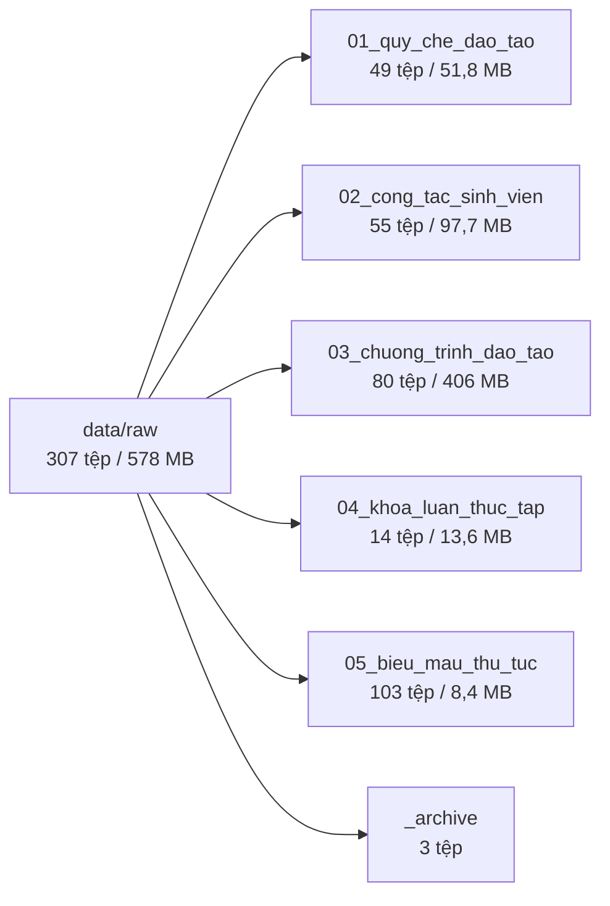
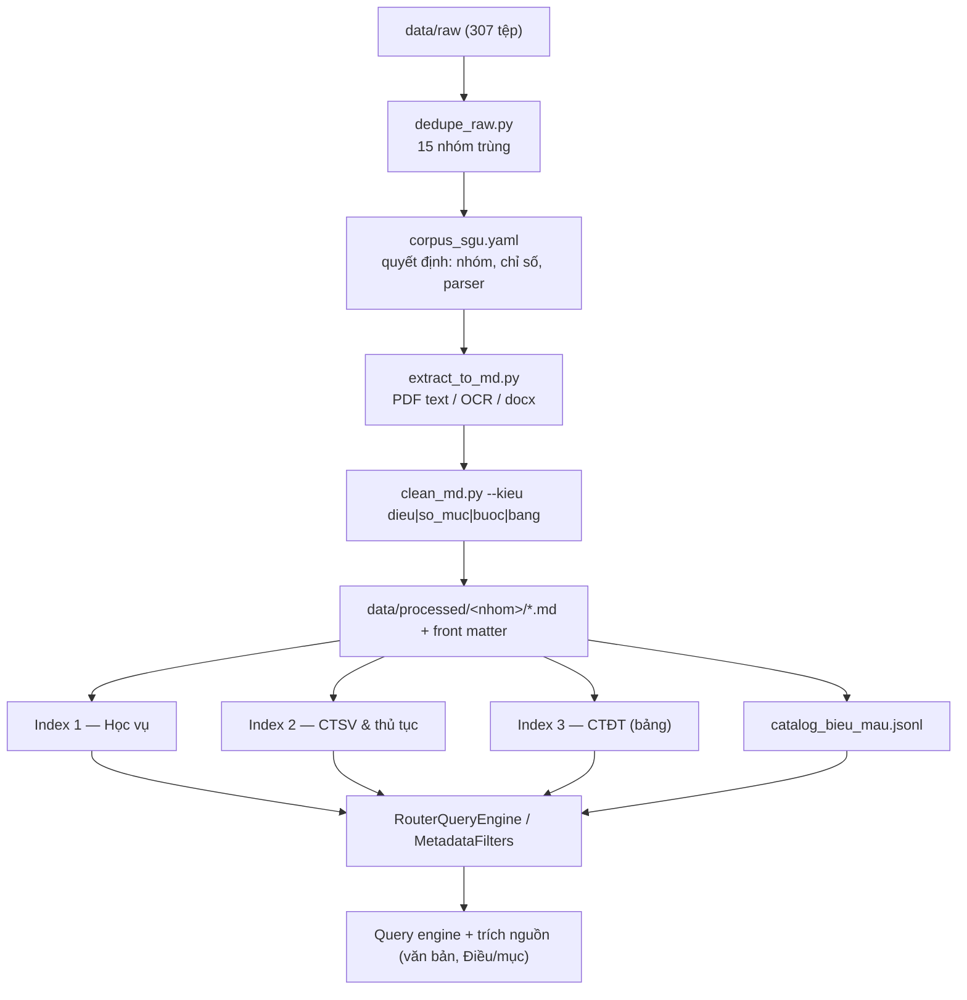

# Phân loại tài liệu đưa vào RAG và hướng giải quyết

> **Ngày:** 2026-10-05 · Bổ sung cho [`bao_cao_danh_gia_du_lieu_raw.md`](bao_cao_danh_gia_du_lieu_raw.md) (đánh giá raw),
> [`bao_cao_mo_rong_corpus.md`](bao_cao_mo_rong_corpus.md) (khảo sát nguồn) và [`bao_cao_cai_tien_rag.md`](bao_cao_cai_tien_rag.md) (12 kỹ thuật).
>
> **Khác biệt so với các báo cáo trước:** tài liệu này phân loại theo **đúng cây thư mục hiện tại** (sau khi đã dọn
> 3,67 GB video/rar), gắn mỗi lớp với **đúng công cụ đang có trong repo** (`extract_to_md.py`, `clean_md.py`,
> `processed_loader.py`) và chỉ ra **chỗ nào công cụ chưa làm được** — đó là phần "hướng giải quyết".

---

## 1. Hiện trạng kho tài liệu (số đo lại)

| Chỉ số | Giá trị |
|---|---|
| Số tệp trong `data/raw` | **307** (304 tài liệu + 2 manifest CSV + 1 `.gitkeep`) |
| Dung lượng | **578 MB** (đã giảm từ ~4,22 GB sau khi bỏ video/rar) |
| Định dạng | 203 `.pdf`, 57 `.docx`, 41 `.doc`, 1 `.xlsx`, 2 `.csv` |
| Có dòng trong `metadata_manifest.csv` | **304/304** (kèm `sha256`, `trung_noi_dung_voi`, `url`, `nguon`) |
| Tệp trùng nội dung (sha256) | **30 dòng / 12 nhóm** → 304 tệp quy về **286 nội dung khác nhau**, bỏ được **18 tệp dư** |
| Đã qua tầng 1 (`data/ocr`) | 14 tài liệu: 13 trong `01_quy_che_dao_tao/1_quy_che_dao_tao_dai_hoc` + 1 bản cũ ở gốc `data/ocr/` |
| Đã qua tầng 2 (`data/processed`) | **12** tài liệu (bản `1a. QuyDinhChuyenNganhDaoTao_Don.md` là biểu mẫu nên không đưa sang tầng 2) |
| Đang nằm trong index | 6 văn bản / 54 Node (`src/corpus.py::SGU_HIEU_LUC`) |



### 1.1. Phân bố theo thư mục lá

| Thư mục | Số tệp | MB | Trùng | Vai trò |
|---|---:|---:|---:|---|
| `01_quy_che_dao_tao/1_quy_che_dao_tao_dai_hoc` | 17 | 21,8 | 8 | **Đã nạp một phần** — phần còn lại là bản cũ/trùng |
| `01_quy_che_dao_tao/2_quy_doi_tieng_anh` | 6 | 4,5 | 2 | Chuẩn/quy đổi tiếng Anh không chuyên |
| `01_quy_che_dao_tao/3_cong_tac_thi_ket_thuc_hoc_phan` | 8 | 16,2 | 2 | Thi, hoãn thi, khiếu nại, phúc khảo |
| `01_quy_che_dao_tao/4_xet_tot_nghiep` | 5 | 3,6 | 0 | Xét tốt nghiệp, chuẩn đầu ra |
| `01_quy_che_dao_tao/5_quy_dinh_hoc_vu_khac` | 8 | 4,3 | 1 | Thời gian tối đa, bảng điểm, bản sao, cố vấn HT |
| `01_quy_che_dao_tao/6_he_dao_tao_khac` | 5 | 1,5 | 2 | Liên thông, VLVH, thạc sĩ, tiến sĩ |
| `02_cong_tac_sinh_vien/che_do_chinh_sach_hoc_bong` | 9 | 26,9 | 0 | Học phí, miễn giảm, học bổng |
| `02_cong_tac_sinh_vien/diem_ren_luyen` | 7 | 1,9 | 5 | Điểm rèn luyện (**5 bản y hệt**) |
| `02_cong_tac_sinh_vien/quy_trinh_thu_tuc` | 14 | 1,8 | 0 | 14 quy trình thủ tục (dạng bước) |
| `02_cong_tac_sinh_vien/so_tay_sinh_vien` | 4 | 52,5 | 0 | Sổ tay SV (3 bản) + cẩm nang 42 MB |
| `02_cong_tac_sinh_vien/thong_bao` | 14 | 9,3 | 0 | Thông báo theo học kỳ (`gdct*`, `tbc*`) |
| `02_cong_tac_sinh_vien/van_ban_quy_dinh` | 7 | 5,4 | 0 | Quy chế CTSV, ứng xử, nội trú, ma túy, an ninh |
| `03_chuong_trinh_dao_tao/chu_ky_2016_2020` | 32 | 118,3 | 1 | CTĐT khóa cũ |
| `03_chuong_trinh_dao_tao/chu_ky_2020_2024` | 35 | 136,7 | 1 | CTĐT khóa đang học |
| `03_chuong_trinh_dao_tao/chu_ky_2024_2028` | 8 | 149,3 | 0 | CTĐT khóa mới (file scan nặng) |
| `03_chuong_trinh_dao_tao/bien_che_nam_hoc` | 5 | 1,9 | 2 | Tiến độ năm học |
| `04_khoa_luan_thuc_tap/quy_dinh_chung` | 7 | 11,0 | 3 | QĐ 2590 + điều chỉnh 2025 (nhiều bản) |
| `04_khoa_luan_thuc_tap/khoa_cntt`, `khoa_luat`, `khoa_ngoai_ngu` | 7 | 2,6 | 0 | Kế hoạch KLTN/TTTN theo khoa |
| `05_bieu_mau_thu_tuc/daotao` | 10 | 0,6 | 1 | Mẫu đơn (Word) |
| `05_bieu_mau_thu_tuc/ctsv` | 17 | 0,6 | 0 | Mẫu đơn (Word) |
| `05_bieu_mau_thu_tuc/theo_khoa` | **0** | 0 | 0 | **Thư mục rỗng** |
| `_archive` | 3 | 0,1 | 2 | 2 file 14 byte + 1 `.xlsx` danh sách KLTN |

---

## 2. Phân loại theo mục đích RAG

Nguyên tắc phân loại: **một tài liệu thuộc lớp nào là do (a) người dùng có hỏi được từ nó không, và (b) nó cần
cách cắt nào.** Không phân loại theo nguồn hành chính, vì cùng một văn bản có thể nằm ở nhiều thư mục.

| Lớp | Nội dung | Số tệp | Vào index? | Cách cắt | Ưu tiên |
|---|---|---:|---|---|---|
| **A** | Văn bản quy phạm có cấu trúc **Điều** | ~20 | ✅ Index 1 (Học vụ) | `clean_md.py` hiện có → `### Điều N` | **P1** |
| **B** | Quy định **không** chia Điều (đánh số `I./1./1.1.`), sổ tay | ~10 | ✅ Index 1 hoặc 2 | Cần **chế độ cắt theo số mục** (mở rộng `clean_md.py`) | **P1** |
| **C** | **Quy trình thủ tục** dạng bước | 14 | ✅ Index 2 (CTSV) | Cắt theo bước, giữ trọn quy trình trong 1 Node | P2 |
| **D** | Văn bản **chính sách/CTSV** (Điều + bảng) | ~15 | ✅ Index 2 (CTSV) | Như A, riêng bảng xử lý theo dòng | P2 |
| **E** | **Chương trình đào tạo** theo ngành/khóa | 80 | ✅ **Index 3 riêng** | Cắt theo bảng môn học + metadata `nganh`, `khoa` | P3 |
| **F** | **Biểu mẫu** (41 `.doc` + 56 `.docx` + 6 `.pdf`) | 103 | ❌ Không nạp **nội dung**; chỉ nạp **bảng gợi ý** | Bảng gợi ý (tên mẫu, dùng cho việc gì, link tải) — và **không trả lời** câu hỏi về nội dung mẫu | **P1** |
| **G** | Thông báo, bản trùng, bản hết hiệu lực, `_archive` | ~75 | ❌ Loại / để đối chứng | — | P1 (dọn) |

---

## 3. Chi tiết từng lớp

### Lớp A — Văn bản có cấu trúc Điều (đưa vào Index 1 "Học vụ")

| Tài liệu (đường dẫn rút gọn) | Trạng thái | Ghi chú |
|---|---|---|
| `01_.../1_quy_che_dao_tao_dai_hoc/25_quy-che-dao-tao-...-sai-gon.pdf` | **đã nạp** | QC SGU 2021 (bản chính) |
| `.../QD 3183.2025 - Sua doi Quy che...pdf` | **đã nạp** | 3 bản trùng → chỉ nạp 1 |
| `.../8_QD810QuyDinhVeHocCungLucHaiChuongTrinh...pdf` | **đã nạp** | |
| `.../2022-2375-QyD Chuyen Chuong Trinh...pdf` | **đã nạp** | trùng `5_quy_dinh_hoc_vu_khac/CV2375...` |
| `.../22_quy-dinh-ve-khoi-luong-dao-tao...pdf` | **đã nạp** | không chia Điều (vào lớp B thực chất) |
| `.../Quydinh150tc.pdf` | **đã nạp** | không chia Điều |
| `01_.../3_cong_tac_thi/3260-QD-Hoan-thi-.pdf` (= `20251120..._HoanThi.pdf`) | chưa | câu "ốm có được hoãn thi" đã bị từ chối trong nhật ký |
| `01_.../3_cong_tac_thi/QD898BanHanhQuyDinhToChucThiHocKi.pdf` (5 MB) hoặc bản `Quy dinh ve cong tac to chuc thi hoc ki.pdf` | chưa | chọn **một** bản; bản 5 MB nhiều khả năng là scan |
| `01_.../3_cong_tac_thi/HD-Quy trinh phuc khao...pdf` (2 bản) | chưa | dạng quy trình → lớp C |
| `01_.../3_cong_tac_thi/CV_3248_001_khieunai.pdf` | chưa | công văn → lớp D |
| `01_.../4_xet_tot_nghiep/06.-QuyDinhXetTN2017.pdf`, `03.-QyD_xetCNTN_2014.pdf` | chưa | **cần kiểm tra hiệu lực** |
| `01_.../4_xet_tot_nghiep/TB_ChuanDauRa_2020.pdf`, `CDR1.pdf`, `CDR2.pdf` | chưa | chuẩn đầu ra → lớp E nếu theo ngành |
| `01_.../5_quy_dinh_hoc_vu_khac/24_quy-dinh-so-736...pdf` | chưa | **xung đột với QC 2021 Điều 2** |
| `01_.../5_.../QĐ_CVHT.pdf`, `QuyDinh_CapBangDiem.pdf`, `QuyDinh_CapBanSao.pdf` | chưa | 3 câu hỏi thủ tục rất hay gặp |
| `01_.../6_he_dao_tao_khac/10_quy-che-...-vua-lam-vua-hoc.pdf`, `9_quy-che-dao-tao-lien-thong.pdf` | chưa | 2 bản liên thông trùng nhau |
| `02_.../van_ban_quy_dinh/21_qui-tac-ung-xu-cua-nguoi-hoc...pdf` | chưa | có cấu trúc Điều |
| `02_.../diem_ren_luyen/1_qui-dinh-ve-danh-gia-diem-ren-luyen...pdf` | chưa | **5 bản y hệt** → nạp 1 |
| `02_.../diem_ren_luyen/2_thong-bao-...-bo-sung-dieu-chinh...pdf` | chưa | sửa đổi của bản trên |
| `02_.../che_do_chinh_sach_hoc_bong/27_quyet-dinh-1357...pdf` + `28_quyet-dinh-2946...pdf` | chưa | cặp gốc + sửa đổi thứ hai |
| `04_.../quy_dinh_chung/23_qui-dinh-ve-quan-ly-to-chuc...-khoa-luan...pdf` | chưa | bản gọn 180 KB, nên ưu tiên hơn các bản scan 2,4–4,3 MB |
| `04_.../quy_dinh_chung/QD_DieuChinhKLTN_2025.pdf` | chưa | 3 bản trùng → nạp 1 |

> **Ước lượng:** ~20 tài liệu lớp A → khoảng **250–350 Node** (trung bình 12–18 Node/văn bản, dựa trên QC 2021 cho 25 Node).

### Lớp B — Không chia Điều (cần mở rộng `clean_md.py`)

| Tài liệu | Dạng cấu trúc | Cách cắt đề xuất |
|---|---|---|
| `04.-QyD_736_thgiantoidahoctaitruong_CQ_2014.pdf` / `24_quy-dinh-so-736...pdf` | Ma trận `1.` → `1.1.` (hình thức × trình độ) | Mỗi mục cấp 2 một Node, **ghép đường dẫn tiêu đề vào đầu text** (`QĐ 736 > 2. Vừa làm vừa học > 2.3. Liên thông`) — vì `1.3` và `2.3` có tiêu đề giống hệt nhau |
| `so_tay_sinh_vien/nh20212022_p1.pdf` (85 trang, có text) | Chương/mục hỏi–đáp | `MarkdownNodeParser` sau khi chuyển sang MD có `#/##/###`, hoặc parser theo mục; mỗi cặp hỏi–đáp 1 Node |
| `so_tay_sinh_vien/nh20212022_p2.pdf` (143 trang) | Kế hoạch đào tạo theo ngành | Tách sang **Index 3 (CTĐT)** |
| `so_tay_sinh_vien/1_so-tay-sv-2020-2021-phan-1.pdf` | Như bản 2021–2022 | Chỉ dùng làm **đối chứng phiên bản** |
| `bien_che_nam_hoc/BienCheNamHoc_2026-2027.pdf` | Bảng ngày tháng | Cắt theo nhóm dòng + **lặp header**; câu hỏi dạng "khi nào thi/nghỉ Tết" |
| `22_quy-dinh-ve-khoi-luong-dao-tao...pdf`, `Quydinh150tc.pdf` | 1 trang, văn xuôi | Giữ 1 Node/văn bản (như hiện tại) |

### Lớp C — Quy trình thủ tục (14 tệp, Index 2 "CTSV")

`quy_trinh_thu_tuc/1..14_*.pdf`: xét điểm rèn luyện, học bổng KKHT, chế độ chính sách, cấp bảng điểm rèn luyện,
rút hồ sơ, giấy xác nhận (2 loại), bảo lưu, vào học lại, chỉnh sửa điểm rèn luyện, chỉnh sửa thông tin, thôi học,
chuyển từ trường khác về, đăng ký quay phim/chụp hình.

**Cách cắt:** mỗi quy trình là **một Node trọn vẹn** (hoặc Node theo bước có tiền tố đường dẫn). Không cắt giữa
các bước vì câu trả lời sẽ thiếu bước. Metadata bắt buộc: `ten_thu_tuc`, `bo_phan_thuc_hien`, `thoi_han`,
`mau_don` (liên kết sang catalog biểu mẫu ở lớp F).

### Lớp D — Chính sách và công tác sinh viên (Index 2)

- `che_do_chinh_sach_hoc_bong/*`: NĐ 238/2025 học phí (2 bản: 1,6 MB và 16 MB — chọn bản nhỏ), QĐ 66/2013,
  VBHN 05/2021 học bổng, NĐ 57/2017, NĐ 116/2020 hỗ trợ SVSP, danh sách đối tượng miễn giảm, **cặp học bổng
  1357/2026 + sửa đổi 2946/2026**.
- `van_ban_quy_dinh/*`: QC công tác sinh viên, QĐ 1299/2018, QĐ 1895/2021, quy tắc ứng xử, nội trú, ma túy,
  an ninh chính trị.
- ⚠️ **NĐ 238/2025 là mức trần của Chính phủ, không phải học phí SGU.** Nạp vào sẽ khiến hệ thống trả lời sai
  câu "một tín chỉ bao nhiêu tiền" (đã ghi trong [`bao_cao_cai_tien_rag.md`](bao_cao_cai_tien_rag.md) mục 4).
  **Đề xuất: nạp nhưng bắt buộc ghi metadata `pham_vi="mức trần Chính phủ"`** để prompt/nguồn nói rõ, hoặc loại
  hẳn cho tới khi có thông báo học phí của trường.

### Lớp E — Chương trình đào tạo (80 tệp / 406 MB) → **Index 3 riêng**

Đặc điểm: phần lớn là **bảng danh mục môn học** theo kỳ, tên file mã hoá (`1620_KTPM.pdf`, `DKP.pdf`,
`CTDT_...`), nặng (nhiều bản scan). Không nên trộn vào Index 1: một câu hỏi về "rút học phần" sẽ bị 80 tệp CTĐT
chen vào top-k.

**Giải pháp:**
1. Không OCR hàng loạt trước — chỉ OCR 8 tệp chu kỳ 2024–2028 (khóa mới) trước, vì đó là khóa đang hỏi.
2. Metadata bắt buộc: `nganh`, `ma_nganh`, `khoa` (khóa tuyển sinh), `trinh_do`, `tong_tin_chi`.
3. Cắt bảng theo nhóm dòng (mỗi học kỳ 1 Node) và **lặp lại dòng tiêu đề cột** trong mỗi Node; giữ nguyên
   học kỳ trong `duong_dan_muc`.
4. Dùng `MetadataFilters` theo `nganh` + `khoa` trước khi truy hồi, hoặc `RouterQueryEngine` chọn giữa Index 1
   và Index 3.

### Lớp F — Biểu mẫu (103 tệp: 41 `.doc` + 56 `.docx` + 6 `.pdf`) → **bảng gợi ý, không nạp nội dung** ✅ đã chốt

**Quyết định:** biểu mẫu chỉ dùng để **gợi ý mẫu cần nộp** (tên mẫu, dùng cho việc gì, link tải). **Nội dung chi tiết
của mẫu không được nạp vào RAG**, và khi người dùng hỏi nội dung/cách điền mẫu thì hệ thống **không trả lời**, chỉ
đưa liên kết tải mẫu.

Lý do bỏ nội dung mẫu: (1) nội dung là khuôn mẫu ("Cộng hòa xã hội chủ nghĩa Việt Nam", "Họ và tên: …") nên chỉ
làm loãng không gian vector; (2) nội dung mẫu thay đổi theo biểu mẫu hành chính, không phải quy định để tra cứu.

**Điểm thuận lợi đã kiểm tra:** cả **103** tệp trong `05_bieu_mau_thu_tuc` đều có `url` trong
`metadata_manifest.csv`, và nhiều tệp đã có `tieu_de` đúng nghĩa ("Đơn xin hoãn thi", "Mẫu đơn xin công nhận và
chuyển điểm") → **không cần chuyển 41 tệp `.doc` sang `.docx`** để làm bảng gợi ý.

**Cảnh báo quan trọng:** *không nạp nội dung mẫu **không đủ** để hệ thống không trả lời.* Các quy trình ở lớp C có
nhắc "nộp đơn xin bảo lưu" và có thể mô tả vài mục trong đơn, nên LLM vẫn có thể dựng lại một "mẫu đơn" nghe hợp lý.
Vì vậy phải làm **hai lớp cùng lúc**:

| Lớp | Việc | Ở đâu |
|---|---|---|
| Dữ liệu | Chỉ nạp bảng gợi ý (mỗi mẫu 1 Node `###`, kèm `loai: bieu_mau`) | `scripts/build_catalog_bieu_mau.py` → `data/processed/05_bieu_mau_thu_tuc/catalog_bieu_mau.md` |
| Chính sách | Guard chặn câu hỏi về nội dung mẫu + một dòng trong `QA_PROMPT` | `src/policy.py` + `src/query_engine.py` |

Chi tiết code và kiểm thử: xem [`de_xuat_code_cai_tien_pipeline.md`](de_xuat_code_cai_tien_pipeline.md) ĐX-6.1–6.3.
Chỉ số bắt buộc theo dõi: **từ chối đúng tăng, từ chối sai không tăng** (từ chối sai đang là vấn đề đã đo được:
52% trong nhật ký 56 câu).

### Lớp G — Loại khỏi pipeline

| Nhóm | Số tệp | Xử lý |
|---|---:|---|
| `_archive/fileManager`, `fileManager_1` (14 byte, lỗi 404) | 2 | Xóa |
| `_archive/Danh-sach-khoa-luan-tot-nghiep-CNTT.xlsx` | 1 | Giữ ngoài pipeline (hoặc xóa) |
| `02_.../thong_bao/*` (`gdct*`, `tbc*`, `tbcdcs*`, `TB2611`) | 14 | Không nạp (thông báo theo học kỳ, hết giá trị nhanh) |
| Bản trùng sha256 | 18 | Giữ 1 bản theo quy tắc ở Mục 4 |
| Bản hết hiệu lực (QC 43/2007, QC 2017, VBHN 17/2014, TT 57) | ~6 | Giữ trong `data/raw` nhưng **loại khỏi index trả lời**; chỉ nạp khi làm kỹ thuật "truy hồi theo thời điểm hiệu lực" |
| `05_bieu_mau_thu_tuc/theo_khoa/` | 0 | Thư mục rỗng — bỏ hoặc điền sau |
| `so_tay_sinh_vien/CAMNANGTSVSGU2022.pdf` (42 MB) | 1 | Gần như toàn ảnh → không OCR; chỉ lấy mục lục nếu cần |

---

## 4. Khử trùng lặp: quy tắc và cách làm

Theo `sha256` trong `metadata_manifest.csv`: **12 nhóm trùng**, gồm 1 nhóm 5 bản (điểm rèn luyện), 3 nhóm 3 bản
(QC 2021, QĐ 3183, QĐ điều chỉnh KLTN 2025) và 8 nhóm 2 bản → bỏ được **18 tệp dư**.
Ngoài ra còn **2 cặp cùng văn bản nhưng khác sha256** (bản scan khác nhau) phải chọn tay: QĐ 2590 (4 tệp) và
quy định thời gian tối đa (3 tệp: `04.-QyD_736...`, `24_quy-dinh-so-736...`, `DHSG_quy-dinh-thoi-gian-toi-da...`).

Quy tắc chọn bản chuẩn:

| Nhóm trùng (theo sha256, trừ 2 dòng ghi chú) | Số bản | Giữ bản nào | Lý do |
|---|---:|---|---|
| QC SGU 2021 | 3 | `1_quy_che_dao_tao_dai_hoc/25_quy-che-dao-tao-...sai-gon.pdf` | Tên có ý nghĩa, đang được `src/corpus.py` dùng |
| QĐ 3183/2025 | 3 | `QD 3183.2025 - Sua doi Quy che...pdf` | Đang được dùng |
| QĐ 2375/2022 chuyển chương trình | 2 | bản trong `1_quy_che_dao_tao_dai_hoc` | Tránh trùng với thư mục khác |
| Quy định điểm rèn luyện | **5** | `1_qui-dinh-ve-danh-gia-diem-ren-luyen-...pdf` | Bản có tiền tố số thứ tự |
| QĐ 3260 hoãn thi | 2 | `3260-QD-Hoan-thi-.pdf` | Tên có số hiệu văn bản |
| QĐ điều chỉnh KLTN 2025 | 3 | `QD_DieuChinhKLTN_2025.pdf` | Không có hậu tố nguồn |
| QĐ 2590 KLTN | 4 tệp **khác sha256** | `23_qui-dinh-ve-quan-ly-to-chuc...pdf` (180 KB) | Cùng một văn bản, 4 bản scan/trích khác nhau → phải mở kiểm tra bằng mắt trước khi chọn |
| Biên chế 2026–2027 | 2 | `BienCheNamHoc_2026-2027.pdf` | |
| Liên thông (QĐ/QC) | 2 | `9_quy-che-dao-tao-lien-thong.pdf` | |
| TT 2366 tiếng Anh | 2 | tên có dấu tiếng Việt đúng | |
| QĐ 736/2014 | 3 tệp **khác sha256** | `24_quy-dinh-so-736...pdf` | Cùng quy định thời gian tối đa; còn `DHSG_quy-dinh-thoi-gian-toi-da...pdf` |
| `fileManager` | 2 | xóa cả hai | |
| CTĐT `1620_KTPM.pdf` = `DKP.pdf` | 2 | giữ bản có mã ngành rõ | |

**Cách làm (đề xuất script `scripts/dedupe_raw.py`):** đọc `metadata_manifest.csv`, nhóm theo `sha256`, in bảng
nhóm + bản đề xuất giữ, chỉ **di chuyển** các bản không giữ vào `data/raw/_duplicates/` (không xóa), rồi ghi lại
manifest. Giữ thao tác ở mức "di chuyển" để còn hoàn tác.

---

## 5. Lỗ hổng công cụ và cách bù

### 5.1. `.doc` (41 tệp) không có đường đi trong pipeline — ⛔ **đã chốt: không cần xử lý**

> Vì nội dung biểu mẫu không được nạp (lớp F), 41 tệp `.doc` chỉ cần **tên mẫu + link** — cả hai đều có sẵn
> trong `metadata_manifest.csv`. Phần phân tích dưới đây giữ lại để tham khảo nếu sau này đổi quyết định.

`extract_to_md.py` lọc `p.suffix.lower() in {".pdf", ".docx"}` → bỏ qua `.doc`.

**Giải pháp (chọn 1):**
1. **Khuyến nghị — LibreOffice headless**: `soffice --headless --convert-to docx --outdir data/raw/_converted <file.doc>` rồi để `extract_to_md.py` xử lý `.docx`. Không cần thêm thư viện Python, chạy lại được, và chất lượng chuyển đổi tốt.
2. `antiword`/`catdoc` → text thuần, mất bảng và định dạng.
3. Bỏ qua `.doc` và chỉ làm catalog bằng tên tệp — chấp nhận được **chỉ vì** toàn bộ 41 tệp `.doc` là biểu mẫu (lớp F).

Vì 41/41 tệp `.doc` đều là mẫu đơn, phương án 3 là đủ cho RAG; nhưng nếu muốn trích "mẫu đơn này cần điền gì"
thì nên làm phương án 1.

### 5.2. `clean_md.py` chỉ hiểu `Chương`/`Điều`

Hiện `to_markdown()` chỉ nhận `CHUONG`, `DIEU`, `SUA_DOI`. Với lớp B/C/D nó sẽ trả về **một Node khổng lồ**
(hoặc nhiều Node không có nhãn), không trích dẫn được.

**Giải pháp:** thêm tham số `--kieu {dieu,so_muc,buoc,bang}` cho `clean_md.py`, hoặc tách thành
`scripts/clean_md_headings.py` dùng chung hàm làm sạch:

| Kiểu | Nhận dạng | Sinh heading |
|---|---|---|
| `dieu` (hiện có) | `Chương`, `Điều N.`, `Sửa đổi Điều N` | `##` / `###` / `####` |
| `so_muc` | `I.`, `1.`, `1.1.`, `a)` | `##` / `###` / `####` |
| `buoc` | `Bước 1`, `1.`, `- ` trong quy trình | `### Bước N` |
| `bang` | dòng bảng có ≥3 cột tách bởi ≥2 khoảng trắng | `###` theo nhóm dòng + lặp header |

Sau đó `processed_loader.py` không cần đổi nhiều: nó vốn chỉ đọc heading, nên chỉ cần thêm nhánh lấy nhãn mục
(`muc` thay vì `dieu`) và ghi `duong_dan_muc`.

### 5.3. Bảng và metadata hiệu lực còn trống

- `_metadata_van_ban.csv` (trong `data/ocr/...` và `data/processed/...`) có đủ cột `so_hieu`, `ngay_ban_hanh`,
  `ap_dung`, `tinh_trang`, `bi_sua_doi_boi` nhưng **mọi dòng đều rỗng**; `_bao_cao_kiem_tra.md` đã liệt kê sẵn
  câu ứng viên để điền. `processed_loader.py` nay đã sẵn sàng nhận các trường này từ front matter.
- Bảng (học bổng, thang điểm rèn luyện, biên chế) phải được chuyển thành **bảng Markdown** trong tầng 2, mỗi
  nhóm dòng một Node và **lặp lại dòng tiêu đề**.

### 5.4. `data/raw` chưa được `.gitignore`

`.gitignore` vẫn để dòng `# data/raw/*.pdf` bị comment → 578 MB có thể bị `git add` nhầm.
**Đề xuất:** thêm `data/raw/` (và `data/raw/_converted/`, `data/raw/_duplicates/`) vào `.gitignore`.

---

## 6. Kiến trúc index và router đề xuất



| Index | Nội dung | Số Node ước tính | Câu hỏi đại diện |
|---|---|---:|---|
| **1 — Học vụ** | Lớp A + B (trừ sổ tay phần 2) | 250–350 | "rút học phần trong bao lâu", "học cùng lúc hai chương trình" |
| **2 — CTSV** | Lớp C + D + catalog biểu mẫu | 150–250 | "bảo lưu cần gì", "điểm rèn luyện tính sao" |
| **3 — CTĐT** | Lớp E + sổ tay phần 2 | 800–2 000 (nếu cắt theo kỳ) | "ngành CNTT kỳ 5 học môn gì" |

**Mapping vào code hiện tại:**
1. `src/corpus.py` hiện hardcode một `CORPUS_DIR` + dict tiền tố → chuyển thành **manifest**
   `configs/corpus_sgu.yaml` (mỗi mục: `thu_muc`, `tien_to`, `ten_hien_thi`, `nhom`, `chi_so`, `kieu_cat`,
   `so_hieu`, `tinh_trang`). `RAGConfig` chỉ cần trỏ tới manifest + chọn index.
2. `index_builder.py` đã tách `persist_dir` theo profile + corpus → chỉ cần thêm tên index thứ ba là đủ.
3. `processed_loader.py` thêm `muc`/`duong_dan_muc` và nhận `nhom`, `so_hieu`, `tinh_trang` (đã có sẵn nhánh).
4. Router: dùng `RouterQueryEngine` (LlamaIndex core) sau khi có 3 index; trước mắt có thể dùng
   `MetadataFilters` trên một index chung để đo chênh lệch, rồi mới tách index.

---

## 7. Xung đột phiên bản — danh sách phải xử lý

| Cặp | Vấn đề | Giải pháp |
|---|---|---|
| QC 43/2007 → QC 2017 → VBHN 17/2014 → **QC 2021** | 4 bản cùng chủ đề, 3 bản hết hiệu lực | Metadata `tinh_trang=het_hieu_luc`, `thay_the_boi=QC2021`; loại khỏi index trả lời |
| **QC 2021 Điều 2** vs **QĐ 736/2014** (thời gian tối đa) | Hai mức thời gian khác nhau cho cùng câu hỏi; `test_questions_01` đã có câu này | Metadata `hieu_luc_tu`, `bi_sua_doi_boi`; ưu tiên văn bản mới trong prompt; thêm câu hỏi kiểm chứng |
| QC 2021 Điều 7 vs **QĐ 3183/2025 sửa đổi Điều 7** | Đã nạp cả hai; prompt chỉ nhắc bằng lời | Nâng lên **quan hệ Node**: khi lấy Điều gốc thì kèm mục sửa đổi (`NodeRelationship` hoặc postprocessor) |
| QC 2021 Điều 9, 10 vs QĐ 3183 sửa đổi Điều 9, 10 | Điểm B+/C+/D+ chỉ có ở bản mới | Như trên |
| KLTN **QĐ 2590/2022** + **QĐ điều chỉnh 2025** | Bản điều chỉnh có 3 bản trùng | Nạp 1 bản mỗi văn bản + quan hệ sửa đổi |
| Học bổng **1357/2026** + sửa đổi **2946/2026** | Cặp gốc–sửa đổi thứ hai | Dùng làm ca kiểm chứng cho kỹ thuật liên kết sửa đổi |
| Quy định ĐRL + **thông báo bổ sung, điều chỉnh phiếu ĐRL** | Nội dung bổ sung nằm ở văn bản khác | Liên kết sửa đổi; nếu không, sinh viên nhận biểu mẫu cũ |
| Liên thông: `9_quy-che-dao-tao-lien-thong.pdf` = `QD_dao-tao-lien-thong.pdf` | Trùng nội dung | Khử trùng lặp |

---

## 8. Đánh giá đi kèm (bắt buộc để chứng minh mở rộng không làm hỏng hệ thống)

Số liệu hiện tại đã cho thấy **thêm văn bản làm giảm R@1** (87,1% → 81% ở bộ 01 sau khi nạp 4 văn bản mới).
Vì vậy mỗi đợt mở rộng phải đo lại, với 4 thay đổi ở bộ đánh giá:

1. **Nhãn theo (nguồn, Điều/mục)** thay vì chỉ số Điều — hiện `dieu_dung` là số, đã từng cho kết quả ảo khi nhiều
   văn bản có cùng số Điều (luật chấm trong `eval/evaluate.py` đã xử lý một phần).
2. **Recall theo từng nguồn**: xem việc thêm CTĐT/CTSV có làm giảm câu hỏi về Quy chế 2021 không.
3. **Câu hỏi ngoài phạm vi** (học phí, điểm rèn luyện trước khi nạp) gắn nhãn "phải từ chối" — dùng bộ
   `eval/cau_hoi_danh_gia.json` đã có (trường `pham_vi`).
4. **Câu hỏi xung đột phiên bản**: "thời gian tối đa hoàn thành khóa học" (QC 2021 vs QĐ 736), "thời gian rút
   học phần" (QC 2021 vs QĐ 3183) — phải trả lời theo bản đang hiệu lực.

Công cụ đã sẵn sàng: `make eval` (Recall@k, MRR, nDCG, CI bootstrap, McNemar), `make baseline`, `make eval-answers`.

---

## 9. Lộ trình 4 đợt

| Đợt | Việc | Đầu ra | Tiêu chí xong |
|---|---|---|---|
| **0 — Dọn và chuẩn hoá (0,5 ngày)** | Xóa 2 file 14 byte + `.xlsx`; `scripts/dedupe_raw.py` chuyển **18 tệp dư** vào `_duplicates/`; thêm `data/raw/` vào `.gitignore` | `data/raw` sạch, manifest cập nhật | Pipeline còn **286 nội dung khác nhau**; 0 nhóm sha256 trùng; `make test` xanh |
| **1 — Lõi học vụ (2–3 ngày)** | `configs/corpus_sgu.yaml`; nạp ~20 tài liệu lớp A; điền `_metadata_van_ban.csv`; sửa OCR QĐ 3183 | Index 1 với 250–350 Node | `make test` xanh; `make eval` có bảng mới; R@1 không giảm so với 81% |
| **2 — CTSV + thủ tục (2–3 ngày)** | `clean_md.py --kieu buoc/so_muc`; 14 quy trình; chính sách/học bổng; catalog biểu mẫu | Index 2 | 10 câu hỏi thủ tục mới trả lời đúng; câu "điểm rèn luyện" hết bị từ chối sai |
| **3 — CTĐT + router (3–5 ngày)** | 8 CTĐT khóa 2024–2028 trước; cắt bảng theo kỳ; `RouterQueryEngine` hoặc `MetadataFilters` | Index 3 + router | Câu hỏi "ngành X kỳ 5 học gì" đúng; câu hỏi học vụ không bị nhiễu bởi CTĐT |
| **4 — Hiệu lực & sửa đổi (tuỳ chọn)** | Metadata `tinh_trang`; liên kết gốc–sửa đổi bằng `NodeRelationship`; câu hỏi xung đột phiên bản | Kỹ thuật đặc thù văn bản pháp quy | Câu hỏi xung đột trả lời theo bản hiệu lực |

---

## 10. Quyết định cần chốt trước khi làm

| # | Vấn đề | Đề xuất của tôi | Cần bạn chốt |
|---|---|---|---|
| 1 | Xóa hay chỉ di chuyển bản trùng? | **Di chuyển** vào `_duplicates/` (hoàn tác được) | |
| 2 | Có nạp NĐ 238/2025 (học phí) không? | **Có**, nhưng gắn `pham_vi="mức trần Chính phủ"` — nếu không thì loại | |
| 3 | Có nạp 14 thông báo (`gdct*`, `tbc*`) không? | **Không** (hết giá trị nhanh, làm loãng) | |
| 4 | CTĐT: tách index riêng hay lọc metadata trên một index? | Tách **Index 3** cho khóa 2024–2028 trước; đo lại rồi mới mở rộng | |
| 5 | Có xử lý `.doc` (41 mẫu) bằng LibreOffice không? | ✅ **Đã chốt: không** — bỏ nội dung biểu mẫu, chỉ giữ bảng gợi ý (tên mẫu + link có sẵn trong manifest) | Đã chốt |
| 6 | Ba bản scan QĐ 2590 (2,4–4,3 MB) | Chỉ giữ bản gọn `23_qui-dinh-...pdf` | |
| 7 | Sổ tay SV 2020–2021 | Chỉ để **đối chứng phiên bản**, không nạp | |

---

## 11. Việc làm ngay (nếu muốn bắt đầu trong hôm nay)

```bash
# 1. Xem lại 15 nhóm trùng lặp trước khi di chuyển
venv/bin/python - <<'PY'
import pandas as pd
df = pd.read_csv("data/raw/metadata_manifest.csv")
print(df[df["trung_noi_dung_voi"].fillna("").str.strip().ne("")][["file", "trung_noi_dung_voi"]].to_string())
PY

# 2. Nạp thử 3 văn bản lớp A hay được hỏi nhất (hoãn thi, phúc khảo, bảo lưu)
venv/bin/python scripts/extract_to_md.py "data/raw/01_quy_che_dao_tao/3_cong_tac_thi_ket_thuc_hoc_phan"
venv/bin/python scripts/clean_md.py "data/ocr/01_quy_che_dao_tao/3_cong_tac_thi_ket_thuc_hoc_phan"
# 3. Thêm tiền tố vào src/corpus.py rồi đo lại
make eval && make baseline
```
